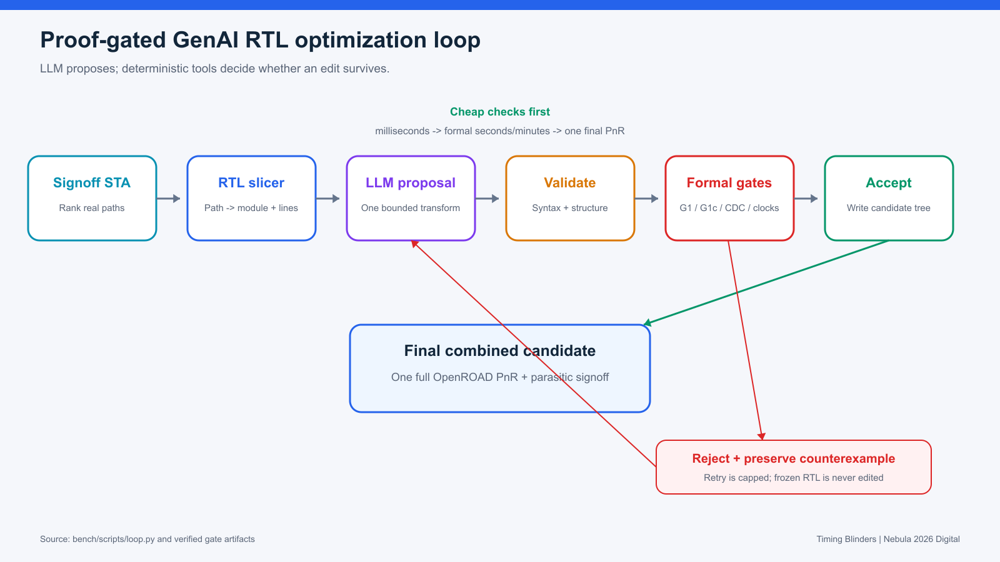
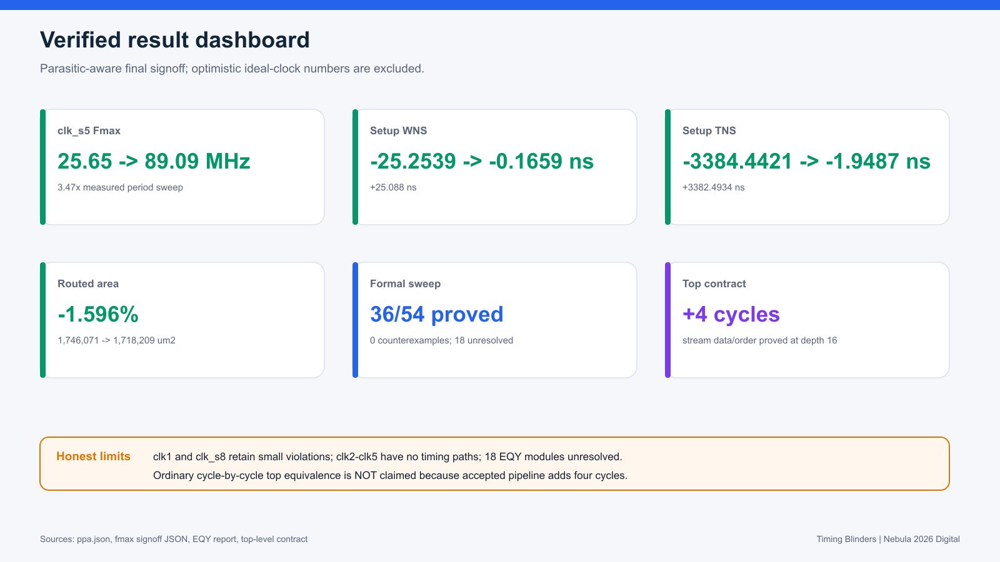
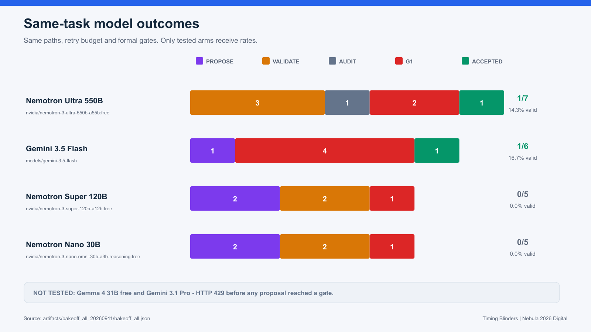
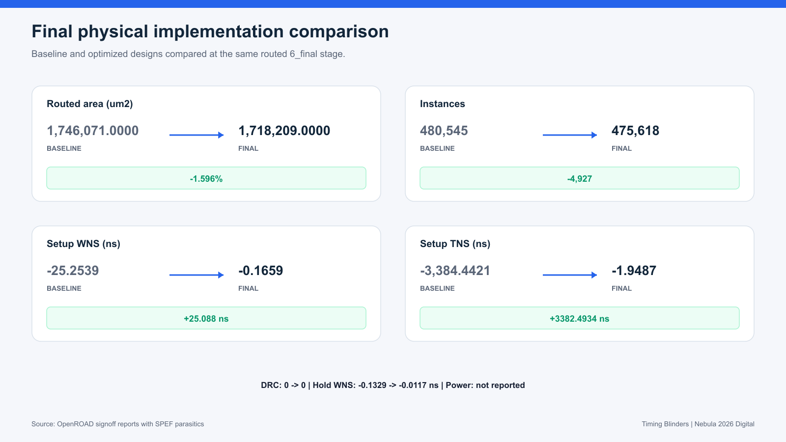
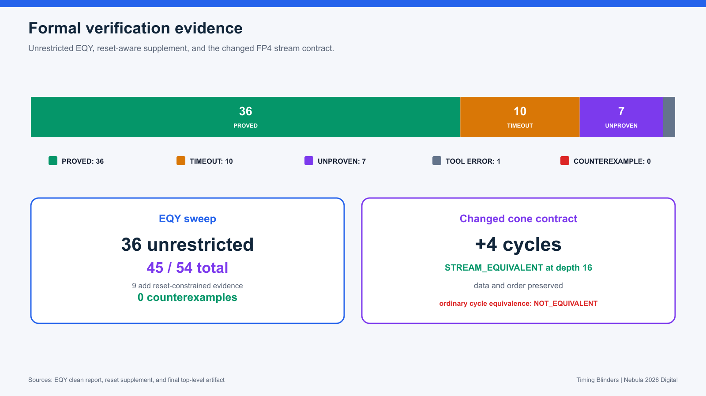

# Constraint Optimization through RTL Enhancement Using Generative AI

**Astera Labs Nebula 2026 - Digital Track** - **Team Timing Blinders:** Shubhanshu Shivhare, Nagarjun BV - IIT Bombay

This project closes a real RTL timing loop with an LLM as proposer and deterministic EDA/formal tools as judges. Frozen input RTL is never edited. Every candidate must survive structural validation, formal equivalence or a declared latency contract, CDC checks, clock checks, and final OpenROAD signoff.

## Verified results

- `clk_s5` Fmax: **25.65 to 89.09 MHz (3.47x)**.
- Setup WNS: **-25.2539 to -0.1659 ns**.
- Setup TNS: **-3384.4421 to -1.9487 ns**.
- Routed area: **-1.596%**; instances: **-4,927 (-1.025%)**.
- DRC: **0**. Final lint: **no new warnings**.
- EQY: **36/54 proved, 0 counterexamples**.
- Changed stream: data and order proved with a declared **+4-cycle latency**.

## Same-task model comparison

Four arms completed under identical paths, retries and gates. Gemma free and Gemini Pro received HTTP 429 before any proposal reached a gate, so both remain **not tested**. Nemotron Ultra's corrected score is **1/7**; the audit removed one historical no-op/wrong-target accept.

Individual model arms were compared by proposal and gate outcomes. Full PnR/PPA was run once on the combined formally accepted candidate, not once per model.

## Physical and formal evidence

The accepted FP4 pipeline is intentionally not cycle-by-cycle identical because it adds four cycles. The qualified result combines byte identity for 52 files, complete combinational equivalence for `fp8_adder`, and a six-property stream proof for the latency-changing cone.

## Complete result pack

- [Figure and data index](output/result_assets/README.md)
- [Model comparison CSV](output/result_assets/data/model_comparison.csv)
- [Per-clock timing CSV](output/result_assets/data/clock_comparison.csv)
- [PPA CSV](output/result_assets/data/ppa_comparison.csv)
- [EQY module results CSV](output/result_assets/data/eqy_module_results.csv)
- [All consolidated results JSON](output/result_assets/data/all_results.json)
- [Evidence summary](artifacts/submission_20260911/summary.md)
- [Detailed worklog](WORKLOG.md)

## Honest limits

- `clk1` and `clk_s8` retain small setup violations.
- `clk2` through `clk5` report no timing paths and are not counted as passing.
- Four timed clocks regress in slack while remaining closed.
- EQY leaves 10 timeout, 7 unproven and 1 tool-error module.
- Five targeted deeper retries produced zero new proofs; the total remains 36/54.
- Paid model arm and demo video remain pending.
