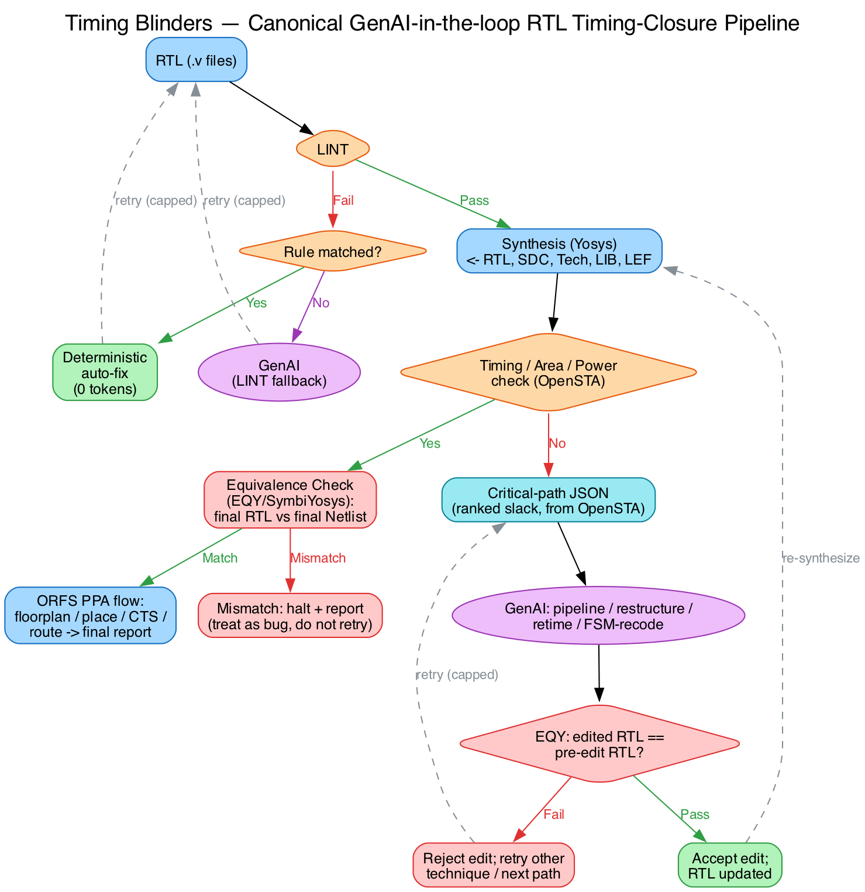

\newpage

# 0. About This Book

This book is the single source of truth for the Timing Blinders project
(Astera Labs Nebula 2026, Digital track — "Constraint Optimization through
RTL Enhancement Using Generative AI"). It is written so that every stage —
every command run, every bug hit, every fix applied, every number
produced — can be reproduced by hand, from scratch, by someone who is
still learning STA/VLSI concepts as they go.

Each chapter covers one stage of the project roadmap. Chapters follow the
same structure: **Goal → Design/Setup → Step-by-step → Problems hit +
fixes → Command reference**. Concepts introduced in one chapter (slack,
WNS/TNS, generated clocks) are assumed known in later chapters — read in
order the first time through.

## 0.1 The Problem Statement

**Topic: "Constraint Optimization through RTL Enhancement Using
Generative AI."**

Timing closure — making a chip design run at its target clock speed — is
one of the most manual, iterative parts of chip design. Engineers analyze
timing reports, find critical paths (signals that don't arrive before the
next clock edge), and manually rewrite RTL to fix them, then re-run
synthesis and repeat.

**Our job**: build a system where an LLM does this instead — reads timing
violations, proposes an RTL fix, and an automated toolchain verifies the
fix actually helps AND doesn't break functional correctness, before
accepting it.

### The four allowed RTL-fix techniques
- **Pipelining** — insert a register mid-path to split one slow cycle
  into two.
- **Logic restructuring** — rewrite logic to be functionally identical
  but with a shorter critical path.
- **Retiming** — move existing registers earlier/later without adding new
  ones.
- **FSM optimization** — re-encode state machine states (e.g. one-hot vs
  binary).

### Required benchmark RTL
- 5 independent asynchronous master clock domains.
- >=1 generated clock per master (10 domains minimum total).
- Clock domain crossings (CDC) between domains.
- Clock divider logic at multiple ratios.
- ~50,000 standard cells (realistic SoC-subsystem scale).

### Official Nebula deliverables (scored against this checklist)
1. RTL timing analysis framework
2. GenAI-based RTL optimization engine
3. Critical path and timing violation analysis
4. Optimized RTL implementation
5. Timing, frequency and PPA comparison (before/after)
6. Formal equivalence verification report (proves optimized RTL == original)
7. Interactive demo showcasing the RTL optimization workflow

### Official tools
Verilog/SystemVerilog, OpenSTA, Yosys, OpenROAD, SymbiYosys/EQY, Python,
LLM/GenAI frameworks.

## 0.2 Canonical Pipeline Diagram (corrected, 2026-08-02)

This is the reviewed, corrected version of Nagarjun's flow sketch —
adds the per-edit EQY gate (not just an end-of-pipeline check), splits
LINT-fail handling into deterministic-fix-first (token-saving) with
GenAI only as fallback, adds explicit iteration caps on every loop, and
names the critical-path JSON as GenAI's actual input at the timing
stage.



**Why GenAI edits RTL only, never SDC (open question resolved 2026-08-02)**:
some timing violations are actually constraint-file bugs, not logic-depth
problems — e.g. Chapter 3's `set_multicycle_path` fix (a legitimately
multicycle path that had no exception declared) is exactly this class,
fixed by editing the SDC, not the RTL. The pipeline deliberately does
NOT let GenAI touch SDC for the graded loop, for two reasons: (1) the
official Nebula problem statement lists exactly 4 RTL-fix techniques,
all RTL-only; (2) EQY can formally prove an RTL edit preserves logic
equivalence, but there is no equivalent formal proof that an SDC
relaxation is "correct" versus just hiding the violation by loosening the
deadline — a judge would read a loosened constraint as gaming the
benchmark. Detecting/fixing genuine SDC bugs (missing multicycle
exceptions, wrong input/output delay budgets) is flagged as a documented
future-work item, not silently dropped — it would need its own,
harder-to-build justification step (proving the relaxation matches real
functional periodicity, the way Chapter 3's `accept` signal justified its
multicycle exception) before it could be safety-gated the way RTL edits
are gated by EQY.

**Why two EQY checks, not one**: the per-edit gate (inside the timing
loop) guards every individual GenAI edit before it's allowed back into
synthesis — this is the non-negotiable safety net. The final end-to-end
check is a cheap extra sanity proof over the whole design right before
committing to the expensive PPA flow; if it ever mismatches while the
per-edit gate passed every edit, that indicates a bug in the loop itself
(e.g. a state file got corrupted), not a bad RTL edit — treat it as
halt-and-investigate, not retry-with-GenAI.

## 0.3 Architecture Being Built

```
run_sta(netlist, sdc)
    -> wraps OpenSTA, returns ranked critical paths + slack as
       structured JSON

propose_and_apply_edit(critical_path, rtl_snippet)
    -> the LLM call. Constrained to propose ONE of: pipelining, logic
       restructuring, retiming, FSM re-encoding. Emits edited RTL, not
       prose.

resynth_and_check(original.v, edited.v)
    -> wraps Yosys (re-synthesis), OpenSTA (re-run STA, compare slack),
       and EQY (formal equivalence gate). REJECTS the edit if EQY fails.

Loop: run_sta -> propose_and_apply_edit -> resynth_and_check ->
      (if improved AND equivalent) accept, else retry/move to next path
      -> repeat until timing closure or iteration budget exhausted.
```

**Non-negotiable design principle**: the EQY formal-equivalence gate must
be built and working BEFORE the LLM loop is wired up. The LLM is never
allowed to edit RTL without the safety net already in place.

## 0.4 Two GenAI Entry Points (confirmed with Nagarjun's flow diagram)

The GenAI loop is not single-purpose — it engages at two distinct points
in the pipeline, both feeding back into the same "Modify/suggest -> RTL"
edge:

1. **LINT-fail loop** — `RTL -> LINT -> (fail) -> auto-fix -> modify RTL`.
   Revised after token-cost review (2026-08-02): most LINT failures
   (unused signal, blocking assignment in a sequential block, width
   mismatch) map to a fixed, mechanical rewrite — a deterministic
   rule-based fixer (plain Python/regex on the linter's rule ID) handles
   these at **zero LLM tokens**. GenAI is only invoked as a fallback for
   LINT errors that don't match a known deterministic rule (expected to
   be rare). This keeps the demo robust to messy input RTL without
   burning tokens on mechanical fixes — token budget is reserved for the
   timing-restructuring loop below, where real judgment is needed.
2. **Timing/Area/Power-fail loop** — `Synthesis -> Timing/Area/Power
   check -> (fail) -> GenAI -> modify RTL`. This is the core
   timing-closure loop described in the architecture above.

**Open item flagged for the team**: in Nagarjun's diagram, the
Equivalence Check (EQY) box sits only AFTER the Timing/Area/Power gate
passes — i.e. it validates the *final* RTL against the *final* netlist
once. Per this project's non-negotiable design rule, EQY must instead
validate **every individual GenAI-proposed edit** before that edit is
allowed to re-enter synthesis — both from the LINT loop and the
Timing/Area/Power loop — not just a single end-of-pipeline check. An
iteration cap (max retries per critical path / per LINT error) should
also be added to both GenAI loops to prevent an infinite modify-retry
cycle if GenAI can't converge on a passing edit.

\newpage

# 1. Pipeline Overview — Full Flow, Tools, Files, and Where the LLM Enters

Read this before diving into individual stage chapters — it is the map of
how everything connects end to end. Individual stage chapters go deep on
one step at a time; this chapter shows how the steps chain together.

## 1.1 The Full Pipeline

```
 1. RTL source (Verilog)          rtl/stageN/*.v
        |
 2. Synthesis (Yosys)             yosys -p "read_verilog...; synth; ..."
    -> gate-level netlist           *_synth.v
        |
 3. SDC constraints (hand-written) rtl/stageN/*.sdc
        |
 4. STA (OpenSTA, via openroad -exit)
    -> run_sta.tcl script reads netlist+SDC, runs report_checks
    -> structured JSON output       artifacts/*.json (ranked critical
                                     paths + slack)
        |
    ========== THIS JSON IS THE LLM'S INPUT ==========
        |
 5. LLM call (Claude API, Stage 8)
    Input:  the JSON (critical path list) + the actual RTL snippet
            around the worst path (file, line range)
    Output: an EDITED RTL snippet, constrained to exactly one of 4
            techniques (pipelining / restructuring / retiming / FSM
            re-encode) -- NOT prose, a tool_use structured code edit
    File:   propose_and_apply_edit.py (Stage 8)
        |
 6. Re-synthesis + re-STA (same Yosys/OpenSTA scripts as step 2-4,
    rerun on the edited RTL) -- did slack improve?
        |
 7. Formal equivalence check (EQY/SymbiYosys, Stage 7)
    .sby config compares original RTL vs edited RTL: logically
    equivalent? NO -> reject edit, discard, try a different fix or move
    to the next critical path. YES -> accept edit, keep it.
        |
 8. Loop steps 4-7 until timing closes (WNS >= 0) or iteration budget
    runs out
        |
 9. Full PPA flow (OpenROAD via ORFS `make`)
    floorplan -> placement -> CTS -> routing -> final area/power/timing
    report. File: flow/designs/<platform>/<design>/config.mk
        |
10. Python glue (Stage 9): one command runs steps 1-9 end-to-end +
    produces the demo (before/after RTL, before/after slack, EQY
    pass/fail trail)
```

## 1.2 Build Status vs Plan

| Step | What it does | Status |
|---|---|---|
| 1-4: RTL -> synth -> SDC -> STA -> JSON | Single-module hand-run flow | Built and working (Ch. 2/3) |
| 5: LLM proposes edit | Claude API tool-use call | Not started (Stage 8) |
| 6: Loop re-check | Re-run steps 2-4 on edited RTL | Not started (Stage 8) |
| 7: EQY formal equivalence gate | Reject bad edits before acceptance | Not started (Stage 7) — must exist before Stage 8 |
| 9: Full PPA flow (ORFS) | floorplan/place/CTS/route + reports | **Built and validated natively** (Ch. 5) |
| 10: End-to-end glue + demo | One command, full pipeline | Not started (Stage 9) |

## 1.3 LLM Connection — Exact Mechanics (Stage 8, not yet built)

- **Trigger**: after step 4 produces the ranked critical-path JSON.
- **Input to the LLM**: that JSON (path, slack, involved cells/pins) plus
  a snippet of the actual `.v` source at the flagged lines.
- **Output from the LLM**: a `tool_use` block containing edited RTL
  text — not free-form chat prose — following Anthropic's documented
  tool-use pattern (structured `tool_use` blocks, loop keyed on
  `stop_reason`).
- **File responsible**: `propose_and_apply_edit.py` (Anthropic Python
  SDK), called from the Stage 9 orchestration loop. Does not exist yet —
  comes only after the Stage 7 EQY gate is working, by explicit project
  design rule: never let the LLM edit RTL without the safety net already
  in place.

## 1.4 On the One-Time Nature of the Native-Build Work

Everything fixed while getting ORFS to build natively on macOS arm64
(CUDD, zstd, icu4c, boost::stacktrace, fmt header includes, Anaconda PATH
contamination, the pinned-Yosys `-c` flag incompatibility with mainline
Yosys — full detail in Chapter 5) is a ONE-TIME native compile of the
toolchain binaries (`tools/install/OpenROAD/bin/openroad`,
`tools/install/yosys/bin/yosys`). Once built, every future `make` run in
`flow/` reuses these binaries directly — no rebuilding, no re-fixing.
This would only need repeating if the `orfs/` repo is wiped or the
project moves to a different machine.

\newpage

# 2. Stage 0 — Digital Logic / STA Fundamentals Refresher

## 2.1 Goal
Hand-build one tiny design, hand-write its SDC, run it through synthesis
+ STA, find a real timing violation, and fix it by manually rewriting RTL
(no tools/scripts doing the thinking) — to relearn STA vocabulary (slack,
arrival time, required time, setup/hold, WNS/TNS) from first principles
before any automation is layered on.

## 2.2 Design: `traffic_light.v`
Moore FSM: RED (4 cyc) -> GREEN (3 cyc) -> YELLOW (1 cyc) -> RED ...
- `state`/`next_state`: 2-bit FSM state register + combinational
  next-state logic.
- `count`: 3-bit datapath counter, counts cycles spent in current state.
- Outputs `red`/`yellow`/`green`: one-hot decode of state.

File: `rtl/stage0/traffic_light.v`. Testbench:
`rtl/stage0/traffic_light_tb.v`.

```
        +-------------------+
        |   traffic_light   |
 clk -->|                   |
 rst_n->|  state/next_state |--> red
        |  count (3-bit)    |--> yellow
        |                   |--> green
        +-------------------+

    RED(4cyc) -> GREEN(3cyc) -> YELLOW(1cyc) -> RED ...
```

## 2.3 Step-by-Step, By Hand

### 2.3.1 Simulate functionally first (before touching timing)
```bash
cd rtl/stage0
iverilog -o sim/tb.out traffic_light.v traffic_light_tb.v
vvp sim/tb.out
```
Confirms functional correctness (FSM sequences RED->GREEN->YELLOW
correctly) independent of timing — always do this before synthesis. A
design that's functionally broken will also produce a nonsense STA
report and waste your time chasing "timing bugs" that are actually logic
bugs.

### 2.3.2 Synthesize to gates (sky130hd)
```bash
yosys -p "
read_verilog traffic_light.v
hierarchy -check -top traffic_light
proc; opt; fsm; opt; memory; opt
techmap; opt
dfflibmap -liberty <path to sky130_fd_sc_hd__tt_025C_1v80.lib>
abc -liberty <same liberty>
clean
write_verilog -noattr traffic_light_synth.v
stat -liberty <same liberty>
"
```
This is a full Yosys synthesis script: RTL -> generic gates
(`proc/opt/fsm/memory`) -> tech-mapped flops (`dfflibmap`) -> tech-mapped
combinational gates + optimization (`abc`) -> clean dangling wires ->
write gate-level netlist. `stat -liberty` prints cell count + area —
sanity-check this isn't zero/huge.

### 2.3.3 Write the SDC by hand
`rtl/stage0/traffic_light.sdc`:
```tcl
create_clock -name clk -period 1.0 [get_ports clk]
set_input_delay -clock clk 1.0 [get_ports rst_n]
set_output_delay -clock clk 1.0 [get_ports {red yellow green}]
```
- `create_clock`: declares the clock, its period, which port it's on.
  Period is in **nanoseconds** by default in OpenSTA. 1.0ns period is
  deliberately aggressive/unrealistic for this design's logic depth,
  chosen ON PURPOSE to force a violation to practice on.
- `set_input_delay`/`set_output_delay`: tells STA how much of the clock
  period is "already spent" before/after this design's boundary (e.g.
  time for a signal to arrive from an upstream chip, or to be used
  downstream) — without these, STA assumes inputs arrive at time 0 and
  outputs have the whole period to work with, which is unrealistically
  generous.

### 2.3.4 Run OpenSTA
`rtl/stage0/run_sta.tcl`:
```tcl
read_liberty <sky130hd typical-corner .lib>
read_verilog traffic_light_synth.v
link_design traffic_light
read_sdc traffic_light.sdc
report_checks -path_delay max -fields {slew cap input}
report_checks -path_delay min -fields {slew cap input}
report_wns
report_tns
exit
```
Run via the OpenSTA docker wrapper (`sta/sta.sh`, mounts repo root at
`/data`):
```bash
./sta/sta.sh /data/rtl/stage0/run_sta.tcl
```
`report_checks -path_delay max` = setup checks (the usual "is my clock
fast enough" check). `-path_delay min` = hold checks (data doesn't race
ahead of the clock edge). Always check BOTH — a design can pass setup
and fail hold or vice versa; they are independent failure modes.

## 2.4 What "Reading the STA Report" Actually Means

Key fields per path in `report_checks` output:
- **Startpoint / Endpoint**: where the path begins (a flop Q, or an
  input port) and ends (a flop D, or an output port).
- **data arrival time**: when the signal actually gets to the endpoint,
  accounting for every gate delay along the path.
- **data required time**: the deadline — when it MUST arrive by (derived
  from the clock period + any input/output delay budget set in the SDC).
- **slack** = required − arrival. **Negative slack = violation.**
  Positive = margin (headroom before it would break).
- **WNS** (Worst Negative Slack) = the single worst (most negative)
  slack across all paths — answers "how much do I need to speed up my
  *worst* path to close timing."
- **TNS** (Total Negative Slack) = sum of ALL negative slacks — tells
  you how widespread the problem is (one bad path vs. many).

## 2.5 The Violation Found and Fixed

First run: worst path was `_39_ -> red`, **slack -0.56ns**. Root cause:
the original RTL had `assign red = (state == S_RED)` — i.e. the output
was combinational logic sitting AFTER the state flop. That combinational
decode gate delay was added on top of the flop's clock-to-Q delay,
pushing arrival time past the deadline.

**The fix — retiming** (one of the 4 allowed RTL-fix techniques): move
the decode logic to evaluate off `next_state` and register the *result*
directly (`red_r <= (next_state == S_RED)`), rather than registering
`state` and then decoding combinationally afterward. Functionally
identical output sequence (since `state <= next_state` on the same edge
anyway) — but now `red`/`green`/`yellow` drive straight off a flop's Q
pin with **zero** combinational gates in the path. See the
`red_r`/`green_r`/`yellow_r` block in `traffic_light.v` (lines 52-62).

**Re-run after fix**: WNS improved -0.56ns -> -0.33ns. Worst path is now
`rst_n -> _48_` (a different, `rst_n`-driven sync-reset-mux path at a
flop's D-input) — a separate, unaddressed issue (11 violations remain,
up from 8, because loosening one constraint can expose others that were
previously masked in `report_checks`'s default single-worst-path-per-
endpoint view — don't assume "violations went up" always means "got
worse"; check WHICH paths and WHY). Confirms retiming can fully
eliminate a specific critical path without touching functionality — this
remaining `rst_n` issue is a different class of problem (looks like an
input-delay budget issue on `rst_n`, not a logic-depth issue) and was
deliberately left out-of-scope for this stage.

## 2.6 Command Reference
```bash
# functional sim
iverilog -o sim/tb.out traffic_light.v traffic_light_tb.v && vvp sim/tb.out

# synthesis (see full script above)
yosys -p "<script above>"

# STA
./sta/sta.sh /data/rtl/stage0/run_sta.tcl
```

## 2.7 Problems Hit + Fixes
None specific to Stage 0 beyond the intentional violation-and-fix
exercise itself (that IS the exercise).

\newpage

# 3. Stage 1 — Generated Clocks + Multicycle Paths

## 3.1 Goal
Real chips have more than one clock. This stage hand-builds the two SDC
constructs needed for that: a **generated clock** (a clock derived from
another clock inside the design, e.g. a divide-by-2) and a **multicycle
path exception** (telling STA "this specific path is allowed more than 1
clock period to settle, because the surrounding logic only uses it every
Nth cycle").

## 3.2 Design: `clkdiv_mcp.v`
- `clk_div2`: divide-by-2 toggle flop off `clk` — this is the generated
  clock.
- `acc`: 32-bit accumulator clocked by `clk_div2`, fed by a deliberately
  deep combinational adder tree
  (`(acc^operand)+(acc&operand)+(acc|operand)+operand`) that's too slow
  to close in 1 `clk_div2` cycle at the given period — by design, so we
  have something to apply a multicycle exception to.
- `accept`: pulses once every 2 `clk_div2` cycles, which is the actual
  functional justification for the multicycle exception — the
  accumulator genuinely only needs a new result every other cycle.

```
 clk --> [/2 toggle flop] --> clk_div2 --> [32-bit acc, deep adder tree]
                                            (needs 2 clk_div2 cycles)
```

## 3.3 Bug #1 Hit + Fixed: X-Propagation in Simulation

Original RTL had no `initial` value on `clk_div2` or `acc`. Trace
through: `clk_div2`'s own always-block is
`if (!rst_n) clk_div2<=0; else clk_div2<=~clk_div2;` — but if `clk_div2`
starts as X, `~X` is still X forever, UNLESS the reset branch fires. The
reset branch only fires on a `posedge clk` while `rst_n==0` — which it
does — so `clk_div2` does reach a real 0. But `acc` is clocked on
`posedge clk_div2`, and `clk_div2` never toggles (thus never posedges)
while held at a stable 0 during the reset window, so `acc`'s own reset
branch (`if(!rst_n) acc<=0`) never actually gets a clock edge to fire on
before `rst_n` deasserts — leaving `acc` X forever via the `^` term in
`sum_wide`.

**Fix**: added sim-only `initial` values (`reg clk_div2 = 1'b0;`,
`reg acc = 32'd0;`) — does NOT change any real reset logic, just seeds
the simulator's initial state to something other than X, which real
silicon doesn't have (flops power up to a real 0 or 1, not X — X is a
simulation artifact of "unknown", not a hardware behavior). **Lesson:
any reg clocked by a derived/gated clock needs an explicit sim initial
value, because you can't always guarantee the derived clock will produce
an edge during the reset window.**

## 3.4 Bug #2 Hit + Fixed: Generated Clock Declared at the Wrong Point

First attempt: `create_generated_clock ... [get_ports clk_div2_out]`
(targeting the output PORT). Result:
`report_checks -path_group {clk clk_div2}` showed **zero paths** in the
clk_div2 group despite the design being fine.

**Why**: a generated clock only propagates FORWARD from the pin/port it
is declared at. `clk_div2_out` is a port with nothing electrically
downstream of it inside this design (it's an output — its only "load" is
outside the chip). Declaring the generated clock there means, from
STA's point of view, the clock signal reaches the boundary and stops —
none of the accumulator's flops (which are driven by the internal
`clk_div2` net, not the port) are seen as being on that clock domain at
all. They're invisible to timing analysis — not violating, just
silently unchecked, which is much worse than a reported violation.

**Fix**: find the actual toggle-flop's output pin in the SYNTHESIZED
netlist (not the RTL — pin names only exist post-synthesis) and target
that:
```bash
grep -n "clk_div2" clkdiv_mcp_synth.v | head
# find the cell instance driving the clk_div2 net, e.g. cell _528_,
# port .Q(clk_div2)
```
```tcl
create_generated_clock -name clk_div2 -source [get_ports clk] \
  -divide_by 2 [get_pins _528_/Q]
```
**Lesson: always declare a generated clock at its actual source pin
(typically a toggle flop's Q), never at a downstream port — grep the
synthesized netlist to find the real cell/pin name; it will NOT match
any RTL signal name directly (`_528_` bears no resemblance to
`clk_div2`).**

## 3.5 Final SDC (`rtl/stage1/clkdiv_mcp.sdc`)
```tcl
create_clock -name clk -period 2.0 [get_ports clk]
create_generated_clock -name clk_div2 -source [get_ports clk] \
  -divide_by 2 [get_pins _528_/Q]
set_input_delay  -clock clk_div2 0.3 [get_ports operand]
set_input_delay  -clock clk_div2 0.3 [get_ports accept]
set_output_delay -clock clk_div2 0.3 [get_ports acc_out]
set_multicycle_path 2 -setup -from [get_clocks clk_div2] -to [get_clocks clk_div2]
set_multicycle_path 1 -hold  -from [get_clocks clk_div2] -to [get_clocks clk_div2]
```
- `-divide_by 2`: tells STA the generated clock's period is 2x the
  master (so `clk`=2ns -> `clk_div2`=4ns automatically, no need to
  hand-specify).
- `set_multicycle_path 2 -setup ...`: extends the SETUP check's deadline
  from 1x period to 2x period for paths between `clk_div2` and itself.
  This is the mechanism — without it, the exact same RTL would show a
  setup violation (deep adder can't finish in 4ns) even though
  functionally it's fine (accept only fires every 2 cycles).
- `set_multicycle_path 1 -hold ...`: **always pair a setup multicycle
  with an explicit hold multicycle** (usually staying at 1, i.e.
  explicitly NOT relaxed) — if you don't, some tools infer a matching
  hold relaxation automatically which can silently hide a real hold
  violation. Being explicit here is a deliberate defensive habit, not
  strictly required by OpenSTA in this exact case, but is standard
  industry practice.

## 3.6 Result
Final: WNS 0.00, TNS 0.00 — multicycle path closes cleanly at the
relaxed 2-cycle (8ns) deadline; without the exception it would show
roughly -3 to -4ns violation (adder needs ~7-8ns, only had 4ns budget).

## 3.7 Command Reference
```bash
# sim (after adding initial values)
iverilog -o sim/tb.out clkdiv_mcp.v clkdiv_mcp_tb.v && vvp sim/tb.out
# check final acc_out isn't X — should print e.g. final acc_out = 9c0b0230

# synth
yosys -p "read_verilog clkdiv_mcp.v; hierarchy -check -top clkdiv_mcp; \
  proc; opt; fsm; opt; memory; opt; techmap; opt; \
  dfflibmap -liberty <lib>; abc -liberty <lib>; clean; \
  write_verilog -noattr clkdiv_mcp_synth.v; stat -liberty <lib>"

# find the generated clock's real source pin
grep -n "clk_div2" clkdiv_mcp_synth.v | head

# STA
./sta/sta.sh /data/rtl/stage1/run_sta.tcl
```

## 3.8 Problems Hit + Fixes Summary

| Problem | Root cause | Fix |
|---|---|---|
| `acc_out` simulates to all-X forever | derived clock never toggles during reset window, so accumulator's reset branch never gets a clock edge | add sim-only `initial` values to `clk_div2` and `acc` regs |
| `clk_div2` timing group shows 0 paths | generated clock declared at output port (nothing downstream) instead of source pin | grep synthesized netlist for real toggle-flop cell, declare at `[get_pins <cell>/Q]` |
| `report_clocks` prints "invalid command" | wrong assumed command name — not a real OpenSTA command in this build | removed; confirmed real command surface via `info commands` |

\newpage

# 4. Stage 6 Prep — SoC Integration & Clock Domain Crossing (CDC)

Read this BEFORE writing any Stage 6 benchmark RTL. It explains the
concepts needed to understand (not just copy) the 5-clock-domain,
~50k-cell benchmark design required by Nebula.

## 4.1 Why 5 Async Masters -> Minimum 10 Clock Domains

Nebula's benchmark spec requires:
- 5 independent asynchronous master clocks.
- >=1 generated clock per master (e.g. divide-by-2/4 off that master,
  like the `clk_div2` exercise in Chapter 3).

So: 5 masters + 5 generated (minimum 1 each) = **10 distinct clock
domains minimum**. Each domain needs its own `create_clock` (masters) or
`create_generated_clock` (derived clocks) declaration in the SDC — same
mechanics as Chapters 2/3, just repeated per domain.

## 4.2 Why ~50,000 Standard Cells

Not a per-domain number — it's a TOTAL scale target across the whole
design, meant to resemble a realistic SoC-subsystem rather than a toy
module (Stage 0's `traffic_light` was on the order of 50-100 cells after
synthesis). Reached not by writing one giant module, but by assembling
several individually-simple blocks (FSMs, datapath/ALU logic,
memory-like structures, CDC synchronizers, clock dividers) — each block
is conceptually no harder than Chapter 2/3, the scale comes from
combining enough of them.

## 4.3 What an SoC Actually Is, Structurally

Not one monolithic thing — several independently-clocked blocks, each
individually as simple as a Stage 0 FSM or Stage 1 accumulator, wired
together hierarchically (a top-level module instantiating child modules
— ordinary Verilog hierarchy, nothing new). The only genuinely new
concept versus Chapters 2/3 is what happens AT THE BOUNDARY where two
different clock domains meet.

```
        clk_A (master 1)              clk_B (master 2)
            |                              |
    +---------------+            +---------------+
    |  Block A (FSM  |            |  Block B (data-|
    |  + control      |            |  path/ALU)     |
    |  logic)         |            |                |
    +--------+--------+            +--------+-------+
             | data_A                       | data_B
             +-----------+       +----------+
                          v       v
                    +-------------------+
                    |  CDC Synchronizer  |  <- bridge between domains
                    |  (2-flop or FIFO)  |
                    +---------+---------+
                              |
                     clk_B domain continues...
```
This pattern repeats across all 5 master domains + their generated
clocks, with a synchronizer at every domain-boundary crossing.

## 4.4 CDC — The Core New Concept for Stage 6

**The problem**: when a signal generated in one clock's domain (say
`clk_A` at 200MHz) is read by logic in a different, asynchronous clock's
domain (`clk_B` at 150MHz), the two clocks' edges don't align
predictably. Wiring signal A straight into a `clk_B`-clocked flop risks
**metastability**: the receiving flop samples mid-transition and can
output a value that's neither a clean 0 nor 1 for a brief period, which
can then propagate downstream as corrupted data or, worse, resolve to
different logic values in different downstream flops reading the same
signal.

**The standard fix — a synchronizer**: typically 2 (sometimes 3) flops
in series, clocked by the RECEIVING domain (`clk_B`), placed directly on
the crossing signal. This gives any metastable state time to settle
before the value is used by real logic. This is a mechanical, well-known
circuit — not something to reinvent per-signal.

**Multi-bit buses need more care**: chaining a 2-flop synchronizer per
bit independently does NOT work for multi-bit values — different bits
can land in the receiving domain on different cycles, producing a
garbage combination that was never a valid value in either domain.
Standard fixes:
- **Gray-coding** the value before crossing (only 1 bit changes per
  increment, so even a misaligned sample differs by at most 1 count) —
  common for crossing counters/pointers.
- **Dual-clock FIFO** (asynchronous FIFO) — the standard block for
  crossing wide data buses, using gray-coded read/write pointers
  internally.

Stage 6 needs at least one instance of each: a simple 2-flop
synchronizer for a single-bit control/status signal, and either a
gray-coded pointer crossing or a small async FIFO for a multi-bit data
crossing.

## 4.5 Problems That Come Up at SoC Scale

| Problem | What it looks like | How it's resolved |
|---|---|---|
| **Timing violation** | `report_checks` shows negative slack on some path | Same 4 techniques as Chapter 2: pipelining, logic restructuring, retiming, FSM re-encoding — applied via the `run_sta -> propose_and_apply_edit -> resynth_and_check` loop (Stage 8), same idea as the Chapter 2 retiming fix, just automated |
| **CDC violation** | a signal crosses domains with no synchronizer, or a multi-bit bus crossed without gray-coding/FIFO | caught by a CDC-specific static check (industry tools: Questa CDC, Spyglass CDC; open-source: partial support in some Yosys passes) — fixed by inserting/correcting the synchronizer structure, not a timing fix |
| **Functional regression after a timing fix** | an RTL edit that improves timing accidentally changes behavior | this is exactly what the **EQY formal equivalence gate** (Stage 7) exists to catch — every proposed edit is proven logically identical to the original before being accepted; if EQY fails, the edit is rejected regardless of how much it improved timing |

## 4.6 Where This Fits in the Roadmap

This chapter is prep reading for **Stage 6** (build the benchmark RTL).
It builds directly on Chapters 2-3 (slack, WNS/TNS, generated clocks,
multicycle paths) — those single-domain fundamentals still apply to
every individual block inside this SoC. CDC is the ADDITIONAL concept
layered on top when multiple such blocks are connected together.

Stage 6 itself (actual RTL, actual SDC, actual synchronizer code, actual
before/after numbers) gets its own chapter once built — this chapter is
concepts-only, written before any Stage 6 code exists.

\newpage

# 5. Stage 5 — OpenROAD-flow-scripts (ORFS): Full RTL-to-GDS PPA Flow

## 5.1 Goal
Run a design through the complete synthesis-to-layout flow (not just STA
on a hand-synthesized netlist like Chapters 2/3) and get real PPA
(Power/Performance/Area) numbers: floorplan, placement, clock tree
synthesis (CTS), routing, and final area/power reports.

## 5.2 The Blocker This Stage Started With, and Why Native Build Was Needed

First attempt used ORFS's official Docker image (`openroad/orfs:latest`).
That image is **amd64-only** (confirmed via `docker manifest inspect` —
no arm64 manifest exists). Running it on Apple Silicon means Docker
silently falls back to QEMU emulation, translating amd64 instructions to
arm64 at runtime. The flow crashed with **SIGILL (illegal instruction)
during CTS** — QEMU's translation doesn't correctly handle certain
CPU-optimized instructions (AVX2/BMI2-class) that OpenROAD's binaries
use.

**Fix chosen** (confirmed with user over two alternatives — patching
QEMU CPU flags, or deferring the issue): **build ORFS natively for
arm64.** Runs real native Apple Silicon instructions, no emulation
layer, no SIGILL risk.

```
   Docker (amd64 image)              Native build (this chapter)
   +-------------------+             +-------------------------+
   | OpenROAD (amd64)   |             | OpenROAD (arm64, native) |
   +---------+---------+             +------------+------------+
             | QEMU translation                    | direct execution
             v                                      v
   Apple Silicon (arm64) <-- SIGILL      Apple Silicon (arm64) <-- OK
       during CTS
```

## 5.3 Building Natively — Full One-Time Dependency Chain

This is a one-time compile. Once done, the binaries at
`tools/install/OpenROAD/bin/openroad` and
`tools/install/yosys/bin/yosys` are reused by every future `make` run —
nothing here needs repeating unless the repo is wiped or moved to a new
machine.

### 5.3.1 Homebrew dependencies
```bash
brew install or-tools qt@5 tcl-tk@8 swig libffi ruby python libomp \
  doxygen capnp bison flex spdlog zlib googletest yaml-cpp icu4c zstd
brew install The-OpenROAD-Project/lemon-graph/lemon-graph
```
`qt@5` and `tcl-tk@8` are specifically the VERSIONED formulas — plain
`qt`/`tcl-tk` are not sufficient. `lemon-graph` must come from
OpenROAD's own tap — the generic `brew install lemon` package doesn't
ship the CMake config files `find_package(LEMON)` needs.

### 5.3.2 CUDD (BDD package) — no Homebrew formula, build from source
```bash
git clone --depth=1 -b 3.0.0 https://github.com/The-OpenROAD-Project/cudd.git /tmp/cudd
cd /tmp/cudd
autoreconf
./configure --prefix=/Users/shubhanshu/Desktop/Nebula/orfs/dependencies
make -j10 install
```

### 5.3.3 Full git submodule fetch (shallow fetch fails on pinned commits)
```bash
git submodule deinit -f .
git submodule update --init --recursive   # NOT --depth 1
```
Shallow (`--depth 1`) fails with "shallow file has changed since we read
it" / commit not found, because the pinned submodule commit isn't a
branch tip GitHub will serve at shallow depth.

### 5.3.4 Anaconda contamination — must be scrubbed from every build invocation
If conda's `base` environment auto-activates in your shell (check
`CONDA_SHLVL`/`CONDA_PREFIX`), `/opt/anaconda3` ships its own `libfmt`,
Python3, and GTest CMake configs that CMake can resolve ahead of
Homebrew's, causing version/ABI mismatches. Every build command in this
chapter strips it:
```bash
CLEAN_PATH=$(echo "$PATH" | tr ':' '\n' | grep -v anaconda | tr '\n' ':' | sed 's/:$//')
env -u CONDA_PREFIX -u CONDA_SHLVL -u CONDA_DEFAULT_ENV -u CONDA_PROMPT_MODIFIER \
  PATH="$CLEAN_PATH" <build command>
```

### 5.3.5 The actual configure + build command
```bash
cd orfs
cmake -B tools/OpenROAD/build tools/OpenROAD \
  -D CUDD_DIR=$(pwd)/dependencies \
  -D TCL_LIBRARY=/opt/homebrew/opt/tcl-tk@8/lib/libtcl8.6.dylib \
  -D TCL_INCLUDE_PATH=/opt/homebrew/opt/tcl-tk@8/include \
  -D FLEX_INCLUDE_DIR=/opt/homebrew/opt/flex/include \
  -D CMAKE_PREFIX_PATH=/opt/homebrew \
  -D CMAKE_IGNORE_PATH="/opt/anaconda3/lib;/opt/anaconda3/include;/opt/anaconda3/bin" \
  -D Python3_FIND_STRATEGY=LOCATION \
  -D Python3_ROOT_DIR=/opt/homebrew/opt/python3 \
  -D CMAKE_EXE_LINKER_FLAGS="-L/opt/homebrew/lib -L/opt/homebrew/opt/icu4c@78/lib" \
  -D CMAKE_SHARED_LINKER_FLAGS="-L/opt/homebrew/lib -L/opt/homebrew/opt/icu4c@78/lib" \
  -D CMAKE_CXX_FLAGS="-DBOOST_STACKTRACE_GNU_SOURCE_NOT_REQUIRED" \
  -D CMAKE_INSTALL_PREFIX=$(pwd)/tools/install/OpenROAD

cmake --build tools/OpenROAD/build --target install -j 10
```

## 5.4 Problems Hit + Fixes (in the order they appeared)

| # | Problem | Root cause | Fix |
|---|---|---|---|
| 1 | SIGILL during CTS | amd64 Docker image under QEMU translation on arm64 | switch to native arm64 build |
| 2 | Shallow submodule fetch fails | pinned commit not servable at shallow depth | full `git submodule update --init --recursive` |
| 3 | `brew --prefix or-tools` fails | not installed | `brew install or-tools` |
| 4 | `qt@5 not found` | plain `qt` insufficient, needs versioned formula | `brew install qt@5` |
| 5 | `tcl-tk@8 not found` | same, versioned formula required | `brew install tcl-tk@8` |
| 6 | `swig missing` | not installed | `brew install swig` |
| 7 | `find_package(LEMON)` fails | generic `lemon` formula lacks CMake config | `brew install The-OpenROAD-Project/lemon-graph/lemon-graph` |
| 8 | `CUDD_LIB NOTFOUND` | no Homebrew formula for CUDD exists at all | build from source into `orfs/dependencies`, pass `CUDD_DIR` |
| 9 | `FLEX_INCLUDE_DIR`/`TCL_LIBRARY` NOTFOUND | CMake couldn't auto-locate versioned Homebrew paths | pass explicit `-D` paths |
| 10 | `fmt::v11::vformat` link error (`fft_test`) + Python3/GTest resolving from `/opt/anaconda3` | conda base env auto-activated, shadowing Homebrew | scrub `/opt/anaconda3` from `PATH`, unset `CONDA_*`, pin `CMAKE_PREFIX_PATH=/opt/homebrew` + `CMAKE_IGNORE_PATH` |
| 11 | `no member named 'format' in namespace 'fmt'` in `AbstractFlowAnalysis.cpp` (persisted after fix #10) | genuine upstream vendoring bug: vendored fmt 11.2.1 needs `<fmt/format.h>` for `fmt::format()`, 10 slang source files only included `<fmt/core.h>` | patched all 10 files: `#include <fmt/core.h>` -> `#include <fmt/format.h>` |
| 12 | `ld: library 'zstd' not found` | bare `-lzstd` linker flag with no `-L` path to Homebrew's lib dir | add `-L/opt/homebrew/lib` via `CMAKE_EXE_LINKER_FLAGS` |
| 13 | `ld: library 'icudata' not found` | `icu4c` is keg-only, not symlinked into `/opt/homebrew/lib` | add `-L/opt/homebrew/opt/icu4c@78/lib` |
| 14 | `Boost.Stacktrace requires _Unwind_Backtrace... Define _GNU_SOURCE` | boost::stacktrace's glibc-only guard doesn't recognize macOS's libunwind-based availability | `-DBOOST_STACKTRACE_GNU_SOURCE_NOT_REQUIRED` in `CMAKE_CXX_FLAGS` |
| 15 | `yosys -c script.tcl`: "Option 'c' does not exist" | tried reusing OSS CAD Suite's mainline Yosys (0.67), which dropped `-c`; ORFS's own pinned/patched Yosys submodule still has it | build ORFS's own `tools/yosys` submodule separately, same fix set (`CMAKE_PREFIX_PATH`, `CMAKE_IGNORE_PATH`, linker `-L` paths, `BOOST_STACKTRACE_GNU_SOURCE_NOT_REQUIRED`) |
| 16 | GDS export step: `Error: KLayout not found` | KLayout (GDS/DRC/LVS viewer+tool) not installed | non-blocking — only affects GDS/DRC/LVS targets, not synthesis/STA/PPA numbers; install KLayout separately if GDS output is needed later |

## 5.5 Running the Flow
```bash
cd orfs/flow
make DESIGN_CONFIG=./designs/sky130hd/gcd/config.mk YOSYS_EXE=<path to ORFS's own yosys>
```
`YOSYS_EXE`/`OPENROAD_EXE` resolve automatically to
`tools/install/{yosys,OpenROAD}/bin/...` if not found on `PATH` (see
`flow/scripts/variables.mk`), so this only needs to be set explicitly if
a different Yosys happens to be on `PATH` first (as OSS CAD Suite's was
in this case).

## 5.6 What the Flow Actually Does, Stage by Stage
```
1_synth     -- Yosys: RTL -> generic gates -> tech-mapped netlist (same
               idea as Chapter 2's manual synth script, run via ORFS's
               own scripts)
2_floorplan -- define chip area, utilization, power grid (PDN)
3_place     -- global placement (approximate positions) then detailed
               placement (legalized, no overlaps)
4_cts       -- Clock Tree Synthesis: insert clock buffers to distribute
               the clock signal to every flop with minimal skew
5_route     -- global routing (coarse) then detailed routing (DRC-clean
               wires)
6_finish    -- final reports: timing (WNS/TNS), area, power, IR drop
```
Each stage writes reports to `flow/reports/<platform>/<design>/base/`,
named `N_<stage>.rpt` (or `_final`/`_check` variants), matching the
numbering above — read the report matching the number of the stage of
interest, e.g. `4_cts_final.rpt` for the post-CTS timing snapshot.

## 5.7 Real Results — `gcd` Design, `sky130hd` Platform

Constraint (`designs/sky130hd/gcd/constraint.sdc`): `clk_period = 1.1ns`
(deliberately aggressive, same "force a violation on purpose" idea as
Chapter 2's traffic light).

| Stage | WNS (max) | TNS (max) |
|---|---|---|
| Post-CTS (`4_cts_final.rpt`) | -1.39 ns | -60.39 ns |
| Final, post-route (`6_finish.rpt`) | -1.47 ns | -65.72 ns |

Post-CTS clock skew: **0.01 ns setup skew** — tight, expected for a
small design with a straightforward clock tree.

Final area/power (`6_finish.rpt` cell report):
- **Design area**: 4977 um² at **85% utilization**
- **Total power**: 8.56 mW (`8.56e-03 W`)
- **Worst-case IR drop**: 1.26 mV on VDD (0.07%), 0.876 mV on VSS
  (0.05%) — both comfortably small relative to the 1.8V supply
- **Cell breakdown**: 839 total cells — 226 multi-input combinational,
  171 timing-repair buffers (inserted by the resizer to fix
  timing/DRC), 35 sequential (flops), 75 tap cells, 7 clock buffers,
  319 fill cells

**Reading this honestly**: WNS is still negative (-1.47ns) — this
design does NOT close timing at this aggressive 1.1ns period as-is.
That's expected and fine for validating the flow itself; timing closure
via RTL edits is exactly what Stage 8's LLM loop will attempt later, on
the Stage 6 benchmark design, using this same report format as its
input.

## 5.8 Command Reference
```bash
# one-time native build (see full dependency list above)
cmake -B tools/OpenROAD/build tools/OpenROAD <all -D flags above>
cmake --build tools/OpenROAD/build --target install -j 10
cmake -B tools/yosys/build tools/yosys -DCMAKE_BUILD_TYPE=Release \
  -DYOSYS_SKIP_ABC_SUBMODULE_CHECK=ON -DCMAKE_INSTALL_PREFIX=$(pwd)/tools/install/yosys \
  <same CMAKE_PREFIX_PATH/CMAKE_IGNORE_PATH/linker/boost flags as OpenROAD build>
cmake --build tools/yosys/build --target install -j 10

# every future run, reusing the built binaries
cd orfs/flow
make DESIGN_CONFIG=./designs/sky130hd/gcd/config.mk

# read results
cat reports/sky130hd/gcd/base/6_finish.rpt      # final WNS/TNS/area/power
cat reports/sky130hd/gcd/base/4_cts_final.rpt   # post-CTS timing + skew
```

\newpage

# 6. Glossary — Every VLSI/STA Term Used in This Book, Explained From Zero

This chapter assumes no prior chip-design background. Read it once, then
use it as a lookup any time a term in a later chapter is unclear. Terms
are grouped by theme, not alphabetically, since related terms are easier
to learn together.

## 6.1 What a Chip "Is", Physically

- **Standard cell**: a pre-designed, pre-characterized small piece of
  circuitry that implements one basic function — an AND gate, a NAND
  gate, a D flip-flop, a buffer. A chip's whole netlist is built almost
  entirely out of thousands to millions of these, laid out on a grid.
  "Standard" means every cell of the same type has a fixed height (so
  rows can pack together) and comes in several drive-strength variants
  (a `_1`, `_2`, `_4` etc. suffix — bigger transistors, faster but more
  power/area).
- **PDK (Process Design Kit)**: the set of files a specific silicon
  manufacturing process (a "node") gives designers: the standard cell
  library (physical layouts + electrical models), design rules (minimum
  spacing/width a manufacturable wire/via can have), and models used by
  every tool in the flow. This project uses **sky130** (SkyWater's open
  130nm process) — the only PDK with a complete, truly open-source
  toolchain (OpenROAD/Yosys/Magic all support it natively, no NDA
  needed), which is why both the OpenROAD-flow-scripts benchmark (Ch. 5)
  and the OpenRAM SRAM macros use it.
- **Liberty file (`.lib`)**: a PDK's per-cell timing/power model — for
  every standard cell, it tables out delay, setup/hold, and power as a
  function of input slew and output load. STA tools read this to know
  "how long does an AND gate actually take." `sky130_fd_sc_hd__tt_025C_1v80.lib`
  used throughout this book: `tt` = typical process corner, `025C` =
  25°C, `1v80` = 1.8V supply — three of the "PVT corners" real designs
  are checked against (worst-case corners like `ss`/slow-slow at high
  temp/low voltage aren't used here, since this project's goal is
  demonstrating the timing-closure loop, not a tape-out-grade signoff).
- **LEF file (`.lef`)**: a cell's physical abstract — pin locations,
  bounding box, metal-layer blockages — used by placement/routing tools.
  Distinct from a `.lib` (electrical timing) and a `.gds` (actual mask
  geometry) — three different views of the same cell, for three different
  jobs (timing, place&route, fabrication).
- **GDS(II)**: the actual manufacturing artwork — every polygon on every
  mask layer. The final output of the whole RTL-to-GDS flow (Ch. 5's
  "6_finish" step, though this project stops at reports, not an actual
  GDS handoff, since there is no intent to fabricate).
- **Netlist**: a circuit described purely as a list of cell instances and
  the wires (nets) connecting their pins — no geometry yet, just
  connectivity. What synthesis (Yosys) produces from RTL, and what STA
  (OpenSTA) and place&route (OpenROAD) both consume.

## 6.2 Clocks and Timing Vocabulary

- **Clock period**: how long one clock cycle takes, in nanoseconds (ns)
  in this book's convention (OpenSTA's default unit unless told
  otherwise). Period 1.0ns = clock frequency 1GHz (frequency = 1/period).
- **Setup check**: "did the new data value arrive at a flop's D-input
  early enough, before the clock edge that will capture it, with enough
  margin for the flop's own internal setup requirement?" This is the
  usual meaning of "is my clock fast enough" — the check that fails when
  logic between two flops is too slow for the chosen period.
- **Hold check**: "did the OLD data value stay stable long enough AFTER
  the clock edge, so the flop doesn't accidentally also capture the NEW
  value racing in too fast?" A completely different, independent failure
  mode from setup — a design can pass setup (nothing is too slow) and
  still fail hold (something is too fast / has too little delay,
  which sounds backwards until you've hit it once).
- **Slack** = required time − arrival time. Positive = margin (safe).
  Negative = violation (the deadline was missed). Both setup and hold
  checks produce their own separate slack numbers per path.
- **WNS (Worst Negative Slack)**: the single worst (most negative) slack
  value across every path checked. One number, easy to track over time —
  "did our worst violation get better or worse."
- **TNS (Total Negative Slack)**: the SUM of every negative slack across
  every failing path (positive-slack paths don't contribute). Tells you
  breadth of the problem — WNS -0.5ns with TNS -0.5ns means one bad path;
  WNS -0.5ns with TNS -40ns means dozens of paths are all somewhat bad.
  Both numbers matter — a fix that improves WNS but worsens TNS (fixes
  the worst path but makes many others slightly worse) is not obviously
  a win.
- **Startpoint / Endpoint**: a timing path always starts at a clocked
  element's output (a flop's Q pin) or a primary input port, and ends at
  a clocked element's input (a flop's D pin) or a primary output port.
  `report_checks` always names both.
- **Arrival time**: the actual, computed time a signal reaches the
  endpoint, summing every gate/wire delay along the path from the
  startpoint.
- **Required time**: the deadline the arrival time is checked against —
  derived from the clock period, any `set_input_delay`/`set_output_delay`
  budget consumed at the path's boundary, and any exception
  (multicycle/false path) that changes the default 1-cycle assumption.
- **Clock-to-Q delay**: the fixed time a flop takes internally to produce
  a stable output after its clock edge — every path's arrival time starts
  with this, then adds every downstream gate's delay.
- **Slew (transition time)**: how fast a signal's voltage actually swings
  from low to high (or vice versa), not instantaneous — a slow slew adds
  extra delay and is itself sometimes a separate design-rule check
  (`max_transition`).
- **Generated clock**: a clock that's not a primary input, but derived
  inside the design from another (usually a "master") clock — e.g. a
  divide-by-2 toggle flop. See Chapter 3 for the full worked example,
  including the "must be declared at the actual source pin, not a
  downstream port" lesson.
- **Multicycle path**: an exception telling STA that a specific path is
  legitimately allowed more than one clock period to settle, because the
  surrounding logic only actually needs/uses that result every Nth
  cycle. Without declaring this, STA defaults to a strict 1-cycle
  deadline and reports a false violation on logic that is, in reality,
  fine. See Chapter 3 for the full worked example and the "always pair a
  setup multicycle with an explicit hold multicycle" rule.
- **False path**: a stronger exception than a multicycle path — tells STA
  a path should not be timed AT ALL (e.g. a path between two clocks that
  are known to never need to be synchronized, or a config register only
  ever written once at boot). Not used yet in this project as of this
  writing, but a standard SDC construct worth knowing exists.
- **SDC (Synopsys Design Constraints)**: the file format (a set of TCL
  commands, `create_clock`, `set_input_delay`, `set_multicycle_path`,
  etc.) used to tell STA/synthesis/place&route tools what timing goals
  and exceptions apply to a design. Every stage chapter in this book has
  a hand-written `.sdc` file — see Chapters 2/3 for two fully worked,
  annotated examples.

## 6.3 Clock Domain Crossing (CDC) Vocabulary

(Full conceptual chapter: Chapter 4. This section is the quick-lookup
version.)

- **Clock domain**: the set of all logic clocked by one specific clock
  signal (a master clock, or one of its generated/divided children).
- **Asynchronous clocks**: two clocks whose edges have no fixed,
  predictable phase relationship to each other (as opposed to two clocks
  that are both derived from the same source and thus have a knowable
  relationship). Signals crossing between asynchronous domains are the
  ones that need CDC protection.
- **Metastability**: what happens when a flop samples its input while
  that input is actively transitioning — the flop's output can hang in
  an undefined, neither-0-nor-1 analog state for a random, unbounded
  amount of time before resolving, and can resolve to different values
  in different downstream flops sampling the same wire. This is a real
  physical phenomenon (not just a simulation artifact), caused by the
  flop's internal feedback loop being pushed into an unstable equilibrium.
- **Synchronizer**: the standard fix — 2 (sometimes 3) flops in series,
  clocked entirely by the RECEIVING domain, placed directly on the
  crossing signal. Gives a metastable state time (typically 1-2 clock
  cycles) to resolve to a stable value before real logic uses it. Only
  works correctly for single-bit signals.
- **Gray coding**: a binary encoding where only ONE bit changes between
  any two consecutive values (unlike normal binary, where e.g. 3->4
  flips three bits at once: `011`->`100`). Used for multi-bit values
  (typically counters/pointers) that must cross clock domains, because
  it guarantees a misaligned sample lands on either the old or the new
  value, never a garbage in-between combination.
- **Asynchronous FIFO**: a dual-clock-domain queue (write side clocked by
  domain A, read side by domain B) used as the standard building block
  for crossing wide data buses, internally using gray-coded read/write
  pointers to safely determine full/empty status across the domain
  boundary.

## 6.4 Synthesis and Optimization Vocabulary

- **RTL (Register Transfer Level)**: the abstraction level this project
  writes Verilog at — describing a design as registers and the
  combinational logic that transfers values between them on each clock
  edge, without specifying actual gates yet.
- **Synthesis**: the process of translating RTL into a gate-level
  netlist made of actual standard cells from a specific PDK, performed
  by Yosys in this project. Involves several sub-steps (see Chapter 7's
  Yosys section for the full script breakdown): generic logic
  optimization, technology mapping (choosing real standard cells),
  and cleanup.
- **Technology mapping (techmap/dfflibmap/abc)**: the specific sub-step
  of synthesis where generic logic (AND/OR/flip-flop) gets replaced with
  actual PDK standard cells (`sky130_fd_sc_hd__and2_1`, etc.), chosen
  based on the liberty file's timing/area/power characteristics.
- **Black-boxing**: telling a synthesis/STA tool "treat this module as an
  opaque block with only the ports you tell it about — do not look
  inside, do not try to synthesize/optimize its internals." Used for
  hard macros (like OpenRAM-generated SRAMs) whose internal transistor-
  level layout is fixed and already characterized — synthesizing "into"
  it would be both wasteful and wrong, since the macro's actual
  implementation isn't Verilog RTL at all past a certain point.
- **Pipelining**: one of this project's 4 allowed RTL-fix techniques —
  inserting a new register partway along a slow combinational path,
  splitting one long cycle's worth of logic into two shorter cycles.
  Changes latency (result available one cycle later) but not throughput
  in most cases, and does not change the final computed value.
- **Retiming**: moving an EXISTING register earlier or later along a
  path (not adding a new one) to rebalance delay between pipeline
  stages, without changing total register count or the function
  computed. Chapter 2's `traffic_light` fix (moving decode logic before
  the register instead of after) is a worked example.
- **Logic restructuring**: rewriting a piece of combinational logic to a
  functionally-identical but shorter-critical-path form (e.g. reordering
  an adder tree, using a carry-lookahead structure instead of ripple-
  carry). The "functionally identical" part is exactly what the EQY
  equivalence gate (Ch. 8) exists to prove, since a restructuring bug is
  easy to introduce by hand or by an LLM.
- **FSM re-encoding**: changing how a finite state machine's states are
  represented in bits (e.g. binary encoding, using the minimum number of
  bits, versus one-hot encoding, using one bit per state) — trades off
  decode-logic depth against register count, and can shorten a critical
  path through the next-state logic.

## 6.5 Verification Vocabulary

- **Functional simulation**: running a design against a testbench that
  applies inputs and checks outputs match expected behavior, with no
  notion of real time delays (a clock is just an abstract tick). Confirms
  LOGICAL correctness only — see Chapter 2's rule "always simulate before
  synthesizing," since a functionally-broken design produces a
  meaningless STA report.
- **Formal equivalence checking**: mathematically proving two circuits
  (e.g. original RTL vs. an LLM-edited version) compute the exact same
  function for every possible input, without simulating any specific
  input pattern — exhaustive by construction, unlike simulation which
  only checks the specific vectors a testbench happens to apply. This
  project's non-negotiable safety net (see Chapter 0.3) — EQY/SymbiYosys
  is the specific open-source tool used (dedicated chapter once built).
- **DRC (Design Rule Check)**: verifying a physical layout obeys the
  PDK's manufacturability rules (minimum spacing, width, enclosure,
  etc.). Runs on GDS-level geometry, late in the flow (Ch. 5's finish
  stage / KLayout).
- **LVS (Layout Versus Schematic)**: verifying a physical layout's actual
  connectivity matches the intended netlist (i.e. the layout wasn't
  accidentally shorted/opened somewhere during place&route). Distinct
  from DRC — DRC checks geometry rules, LVS checks connectivity
  correctness.
- **PPA (Power, Performance, Area)**: the three headline numbers used to
  judge/compare a chip implementation — how much power it draws, how
  fast it runs (performance, closely tied to WNS/achievable clock
  period), and how much silicon area it occupies. Chapter 5's `gcd`
  results (area 4977 um², power 8.56mW) are this project's first real
  PPA numbers.

\newpage

# 7. Tool Reference Manual

This chapter documents every tool used across the project so far, one
section each: what it is, why this project uses it, how it was
installed, and the exact commands/flags this project actually invokes
(cross-referenced back to the stage chapter where each is first used in
context). Read a tool's section here when you need to understand a flag
or command you saw in an earlier/later chapter without re-deriving it
from scratch.

## 7.1 Icarus Verilog (`iverilog` / `vvp`)

**What it is**: an open-source Verilog simulator. Compiles Verilog
source + testbench into an intermediate executable (`iverilog -o`), then
runs it (`vvp`) to actually simulate and print `$display`/`$monitor`
output.

**Why this project uses it**: cheapest, fastest possible check that RTL
is functionally correct BEFORE spending time on synthesis/STA — see the
"always simulate first" rule established in Chapter 2.

**Install**: bundled inside OSS CAD Suite (see 7.6) — no separate install
needed on this project's machine.

**Commands used**:
```bash
iverilog -o sim/tb.out design.v design_tb.v   # compile design+testbench
vvp sim/tb.out                                 # run, prints $display output
```
`-o <path>` sets the compiled output file's name/location. No flags
beyond this were needed for this project's testbenches (no `-g2012` etc.
SystemVerilog flags — all RTL so far is plain Verilog-2001 style).

## 7.2 Yosys

**What it is**: the open-source RTL synthesis tool — reads Verilog,
performs logic optimization, and technology-maps the design down to
actual standard cells from a liberty file, emitting a gate-level netlist.
Also usable as a general Verilog-manipulation toolkit (its TCL-like
internal script language, run via `-p "<script>"`, chains passes
together).

**Why this project uses it**: it's the project's synthesis engine for
every stage chapter so far, and is one of Nebula's officially listed
tools. Also the eventual tool that will re-synthesize every LLM-proposed
RTL edit inside the Stage 8 loop (`resynth_and_check`).

**Install**: two separate copies exist in this project, deliberately:
1. **OSS CAD Suite's bundled Yosys** (0.67 as of this writing) — used for
   all of Chapters 2/3's manual per-stage synthesis scripts.
2. **ORFS's own pinned/patched Yosys submodule**, built natively from
   source (Chapter 5, problem #15) — required specifically because ORFS's
   flow scripts invoke `yosys -c <script.tcl>`, and the `-c` flag was
   removed from mainline Yosys at some point after ORFS's submodule was
   pinned. These are NOT interchangeable — always check which Yosys a
   given command needs (mainline for hand-run Chapter 2/3-style scripts;
   ORFS's own build, `tools/install/yosys/bin/yosys`, for anything run
   via ORFS's `make`).

**Anatomy of this project's standard synthesis script** (used, with minor
variations, in Chapters 2 and 3):
```tcl
read_verilog <design>.v          # parse RTL into Yosys's internal AST/RTLIL
hierarchy -check -top <module>   # resolve module hierarchy, error if the
                                  # named top module doesn't exist or a
                                  # submodule is missing
proc                             # convert always-blocks into internal
                                  # process representation
opt                              # generic logic optimization pass
fsm                              # detect and optimize finite state
                                  # machines specifically (state re-
                                  # encoding opportunities, etc.)
opt
memory                           # infer/handle memory-like structures
                                  # (arrays with sequential read/write
                                  # patterns) as a distinct block type
opt
techmap                          # map generic logic to a technology-
                                  # independent gate library first
opt
dfflibmap -liberty <lib>         # map generic flip-flops to the PDK's
                                  # actual flop cells from the liberty file
abc -liberty <lib>                # run ABC (a separate, bundled logic-
                                  # synthesis/optimization engine) to map
                                  # combinational logic to actual PDK
                                  # standard cells, optimizing for the
                                  # liberty file's timing/area
clean                            # remove now-dangling wires/cells left
                                  # over from optimization passes
write_verilog -noattr <out>.v    # emit the final gate-level netlist;
                                  # -noattr strips Yosys's internal
                                  # attribute comments, keeping the file
                                  # readable/portable to other tools
stat -liberty <lib>               # print cell count + area summary —
                                  # always sanity-check this isn't 0 or
                                  # absurdly large before moving on
```
Each pass name above is a real Yosys command — run `yosys -p "help"` for
the full command list, or `yosys -p "help <passname>"` for one pass's
documentation, inside any Yosys build.

## 7.3 OpenSTA

**What it is**: the open-source static timing analysis engine — reads a
gate-level netlist + liberty file(s) + SDC, and reports setup/hold
timing (arrival/required time, slack, WNS/TNS) without simulating any
actual input vectors (hence "static" — it checks every path
structurally, not by running test patterns).

**Why this project uses it**: the core timing-analysis tool for every
stage chapter, and will be the tool `run_sta()` (the architecture's first
pipeline stage, Ch. 0.3) wraps to produce the LLM's structured JSON
input in Stage 4/8.

**Install/run mechanism**: this project runs OpenSTA via a Docker wrapper
script, `sta/sta.sh`, which mounts the repo root at `/data` inside the
container and forwards a TCL script path:
```bash
./sta/sta.sh /data/rtl/stage0/run_sta.tcl
```
(Note the path INSIDE the container starts `/data/...`, not the host's
absolute path — this trips people up the first time.)

**Anatomy of this project's standard STA script** (Chapters 2/3):
```tcl
read_liberty <lib>                # load the cell timing models
read_verilog <design>_synth.v     # load the gate-level netlist (NOT the
                                   # original RTL — post-synthesis only)
link_design <module>              # resolve/elaborate the netlist against
                                   # the liberty library
read_sdc <design>.sdc             # load clock/timing constraints
report_checks -path_delay max -fields {slew cap input}  # setup checks
report_checks -path_delay min -fields {slew cap input}  # hold checks
report_wns                        # worst negative slack, single number
report_tns                        # total negative slack, single number
exit
```
`-path_delay max` = setup analysis (the default most people mean by "STA
check"); `-path_delay min` = hold analysis — Chapter 2 stresses always
running BOTH, since they're independent failure modes. `-fields {slew
cap input}` adds columns to the per-stage path breakdown showing signal
transition time, capacitance driven, and input pin name — useful for
diagnosing WHY a stage is slow (e.g. high capacitance = the gate is
driving too much fanout/wire).

**Useful diagnostic command**: `info commands` inside an OpenSTA TCL
session lists every real command the build actually supports — used in
Chapter 3 to confirm `report_clocks` wasn't a real command in this
particular OpenSTA build/version (problem row in Ch. 3.8's table).

## 7.4 SymbiYosys (`sby`) / EQY

**What they are**: formal-verification frontends built on Yosys.
**SymbiYosys** (`sby`) drives general formal proofs (assertions, bounded
model checking) via a `.sby` config file. **EQY** is a purpose-built
wrapper specifically for equivalence checking two versions of a design
(exactly this project's need: prove an LLM-edited RTL module computes
the same function as the original).

**Why this project uses it**: this is the formal-equivalence safety net
described as non-negotiable in Chapter 0.3 — every LLM-proposed RTL edit
must be proven equivalent to the pre-edit version before being accepted
back into the pipeline. Not yet built as of this writing (Stage 7, see
Ch. 1.2's status table) — this section will be expanded with the actual
`.eqy` config syntax, commands, and worked example once that stage is
implemented; recorded here now so the tool's role and installation
source (`github.com/YosysHQ/eqy`, `github.com/YosysHQ/sby`, both bundled
inside OSS CAD Suite) is on record ahead of that work.

## 7.5 OpenROAD

**What it is**: the open-source physical-design tool — takes a
gate-level netlist through floorplanning, placement, clock tree
synthesis, and routing, producing a manufacturable (or near-
manufacturable) layout plus final timing/power/area reports. Has its own
built-in STA engine (shares lineage with OpenSTA) used internally at
every physical-design stage to guide optimization (e.g. the resizer
inserting buffers to fix timing during CTS).

**Why this project uses it**: the PPA (PPower/Performance/Area) engine —
Chapter 5's entire flow is built around it, and it's the tool that will
eventually run the Stage 6 benchmark design through the full RTL-to-GDS
flow for final before/after comparison numbers.

**Install**: built natively from source for this project (see Chapter 5
in full — the entire chapter is effectively this tool's install/build
log) because the official Docker image is amd64-only and fails under
QEMU emulation on Apple Silicon (SIGILL during CTS). Binary ends up at
`tools/install/OpenROAD/bin/openroad` inside the `orfs/` repo, reused by
every subsequent `make` run.

**How it's invoked**: not called directly — `orfs/flow/make` orchestrates
calling `openroad` (and `yosys`) with the right scripts/arguments per
flow stage (see Chapter 5.6's stage-by-stage breakdown and 5.5's actual
`make` command).

## 7.6 OSS CAD Suite

**What it is**: a single prebuilt bundle distributed by YosysHQ,
packaging Yosys, OpenSTA, SymbiYosys/EQY, Icarus Verilog, GTKWave, and
several other open EDA tools together, matched to known-working
versions.

**Why this project uses it**: avoids building each tool from source
individually for day-to-day (non-ORFS) work — one download, one
`source environment` line, and every bundled tool is on `PATH`.

**Install** (from the project's root `CLAUDE.md`):
```bash
curl -L -o oss-cad-suite.tgz \
  https://github.com/YosysHQ/oss-cad-suite-build/releases/latest/download/oss-cad-suite-darwin-arm64.tgz
tar xzf oss-cad-suite.tgz
source oss-cad-suite/environment
xattr -dr com.apple.quarantine oss-cad-suite/   # one-time, avoids macOS
                                                  # Gatekeeper popups on
                                                  # every bundled binary
```
Must be `-darwin-arm64` specifically (this project's machine is Apple
Silicon) — the `-darwin-x64`/`-linux-x64` builds will not run.

## 7.7 Nix (package manager, used for OpenRAM only)

**What it is**: a functional, reproducible package manager — packages are
built from declarative "derivations" into a content-addressed store
(`/nix/store/...`), and a `flake.nix` file pins exact versions of every
dependency a project needs, so `nix develop` reproduces an identical
dev-shell on any machine.

**Why this project uses it**: OpenRAM's own repo ships a `flake.nix` that
sets up its entire toolchain (Magic, KLayout, ngspice/xyce, Python +
venv, sky130 PDK tooling) in one reproducible shell — this project uses
that flake as-is rather than hand-installing OpenRAM's dependency list.

**The `--impure` flag, and why it's required every time**: by default,
Nix flakes deliberately ignore externally-exported shell environment
variables, for reproducibility — a flake should build the same way
regardless of what's set in your shell. This project needs
`NIXPKGS_ALLOW_UNSUPPORTED_SYSTEM=1` and `NIXPKGS_ALLOW_BROKEN=1` to be
honored, because `xyce`/`xyce-parallel` (a circuit simulator pulled in by
OpenRAM's flake) is marked `x86_64-linux`-only in its package metadata,
and this project's machine is `aarch64-darwin`. `--impure` tells Nix "let
this evaluation see my real shell environment" — without it, those
`NIXPKGS_ALLOW_*` vars are silently ignored and flake evaluation simply
fails on this platform. This is needed on BOTH the outer `nix develop`
call AND, non-obviously, on OpenRAM's own internal nested bootstrap call
inside `compiler/globals.py`'s `install_nix()` function — see 7.8's bug
list for the fix applied there.

**Commands used**:
```bash
nix --extra-experimental-features 'nix-command flakes' develop --impure --command <cmd>
```
`--extra-experimental-features 'nix-command flakes'` is required because,
as of this project's Nix version, the flake system is still gated behind
an experimental-features flag rather than being on by default.

## 7.8 OpenRAM

**What it is**: an open-source SRAM compiler — given a config file
(word size, number of words, port count, target PDK), it generates a
complete SRAM macro: schematic (`.sp`), gate-level Verilog behavioral
model (`.v`), physical layout (`.gds`), abstract view for place&route
(`.lef`), and timing model (`.lib`) — everything needed to drop the
generated memory into a larger design as a black-boxed hard macro.

**Why this project uses it**: `l1_d_cache_8kb.v` (the L1 data cache RTL)
needs two custom-sized SRAM macros (a 92-bit x 64-word tag memory, and
four 256-bit x 64-word data memories) that don't exist as off-the-shelf
parts — OpenRAM generates them from scratch for the exact sky130 PDK
this project standardizes on.

**Full install, config-file syntax, every bug hit and fixed, and the
generation results are documented in their own dedicated chapter**,
added once macro generation, RTL integration, and synthesis are
confirmed working end-to-end (see Chapter 1.2's build-status table for
current progress). This section exists so the tool's purpose and its
place in the toolchain are on record now, ahead of that chapter.

## 7.9 Homebrew (macOS package manager)

**What it is**: the standard macOS command-line package manager
(`brew install <formula>`), used throughout Chapter 5's native ORFS build
for every dependency that isn't Nix-managed or built from source by
hand.

**Non-obvious lesson from this project** (Chapter 5, problems #4/#5/#7):
some Homebrew formulas ship multiple versions under different names —
`qt@5` and `tcl-tk@8` are DIFFERENT formulas from plain `qt`/`tcl-tk`,
and CMake will not find the versioned libraries unless told the exact
versioned formula's path. Similarly, a generic-sounding formula
(`lemon`) can be a completely different package than the one a project
actually needs (`The-OpenROAD-Project/lemon-graph/lemon-graph`, from
OpenROAD's own Homebrew "tap") — always match the exact formula name a
project's own build instructions specify, don't substitute a
similarly-named one.

\newpage

# 8. Development Environment Setup — Full Machine Record

This chapter is a from-scratch record of every piece of software
installed on this project's machine (macOS, Apple Silicon/arm64) to make
every tool in Chapter 7 available, in the order it was actually needed.
Follow this chapter top to bottom on a fresh machine to reproduce the
whole environment; skip anything already installed.

## 8.1 Baseline Assumptions

- macOS on Apple Silicon (arm64) — every download/build choice in this
  book assumes this. On Intel Mac or Linux, substitute the matching
  architecture's binaries (`-darwin-x64`, `-linux-x64`, etc.) — untested
  by this project, but the same general steps should apply.
- Homebrew already installed (`brew.sh`) — the base package manager used
  for most non-EDA-specific dependencies.
- Git installed (ships with Xcode Command Line Tools, or via
  `brew install git`).

## 8.2 Order of Installation (as actually done on this project)

1. **Xcode Command Line Tools** (`xcode-select --install`) — provides
   the base C/C++ compiler toolchain every from-source build in this
   book needs (CUDD, OpenROAD, Yosys).
2. **Homebrew** — base package manager.
3. **OSS CAD Suite** (Chapter 7.6) — gets Yosys/OpenSTA/Icarus/EQY
   working immediately for Chapters 2/3's hand-run stage work, with zero
   from-source compiling.
4. **Docker Desktop** — needed for `sta/sta.sh`'s OpenSTA container
   wrapper (Chapter 7.3) and was the FIRST attempt at running ORFS
   (before the native-build pivot documented in full in Chapter 5).
5. **ORFS native build dependencies** (Homebrew formulas + CUDD from
   source + the native OpenROAD/Yosys compiles) — the entire dependency
   chain is Chapter 5.3, not repeated here; that chapter IS this step's
   detailed record.
6. **Nix** (`https://nixos.org/download`, or the Determinate Systems
   installer) — needed only once OpenRAM entered scope. Verify with
   `nix --version` and `command -v nix`; if a fresh shell doesn't have
   `nix` on `PATH` (seen inside this project's own background-task
   shells, which don't source the interactive profile), source it
   explicitly:
   ```bash
   source '/nix/var/nix/profiles/default/etc/profile.d/nix-daemon.sh'
   ```
7. **OpenRAM repo clone + its Nix flake** — `git clone` the OpenRAM repo,
   then `nix develop --impure` inside it bootstraps Magic/KLayout/PDK
   tooling. Full install/config/bug-fix record in the dedicated OpenRAM
   chapter (pending, see Chapter 7.8).

## 8.3 Directory Layout (as of this writing)

```
~/Desktop/Nebula/                  <- this repo (RTL, docs, orfs/ clone)
    l1_d_cache_8kb.v                 L1 D-cache RTL (Ch. 9's target)
    rtl/
        stage0/                     traffic_light.v + SDC + testbench (Ch. 2)
        stage1/                     clkdiv_mcp.v + SDC + testbench (Ch. 3)
    sta/
        sta.sh                      Docker wrapper for OpenSTA (Ch. 7.3)
    orfs/                            OpenROAD-flow-scripts clone (Ch. 5)
        tools/
            OpenROAD/build/          native OpenROAD build tree
            install/OpenROAD/bin/    installed openroad binary (reused)
            yosys/build/             ORFS's own pinned Yosys build tree
            install/yosys/bin/       installed yosys binary (reused)
        dependencies/                CUDD, built from source
        flow/
            designs/sky130hd/gcd/    example design used for Ch. 5's
                                     first validated PPA run
            reports/sky130hd/gcd/   flow output reports (Ch. 5.6/5.7)
    docs/
        book/
            nebula_book.md          this book's source (pandoc markdown)
            nebula_book.pdf         rendered PDF (via pandoc)
            pipeline_diagram.dot    graphviz source for Ch. 0.2's diagram
            pipeline_diagram.png    rendered diagram

~/eda/OpenRAM/                     <- OpenRAM repo clone (separate from
                                       the Nebula project repo)
    compiler/                       OpenRAM's Python source
        .venv/                     project-local venv (pip deps installed
                                     here, see OpenRAM chapter for the
                                     requirements.txt install step)
    macros/sram_configs/            per-macro config .py files this
                                     project writes (tag_memory_92x64.py,
                                     id_memory_256x64.py — see OpenRAM
                                     chapter)
    macro/                          OpenRAM's generated output (.v/.lef/
                                     .lib/.gds per macro, once builds
                                     succeed)
    run.sh                          this project's wrapper script, see
                                     OpenRAM chapter, sets every env var
                                     needed and calls nix develop --impure
```

## 8.4 Environment Variables That Matter, and Why

| Variable | Used by | Why it must be set |
|---|---|---|
| `PATH` (with OSS CAD Suite's `environment` sourced) | Yosys/OpenSTA-adjacent/Icarus commands | makes bundled tool binaries findable without full paths |
| `CONDA_SHLVL`/`CONDA_PREFIX`/etc. (must be UNSET, not set) | ORFS native build | if Anaconda's base env auto-activates, its bundled `libfmt`/Python3/GTest CMake configs get resolved ahead of Homebrew's, causing ABI mismatches (Ch. 5, problem #10) |
| `PDK_ROOT` | OpenRAM | tells OpenRAM/ciel where the sky130 PDK files live; this project sets it to the OpenRAM repo root itself, matching what `make sky130-pdk` would set |
| `OPENRAM_HOME` | OpenRAM | must point to `<repo>/compiler` specifically, NOT the repo root — `compiler/globals.py`'s internal path logic assumes this; getting this wrong produces a `FileNotFoundError` on a `None`-containing path (see OpenRAM chapter's bug list) |
| `NIXPKGS_ALLOW_UNSUPPORTED_SYSTEM=1` | Nix (OpenRAM flake) | lets `xyce`, an x86_64-linux-only package, still resolve/build on this project's aarch64-darwin machine, given `--impure` is also passed |
| `NIXPKGS_ALLOW_BROKEN=1` | Nix (OpenRAM flake) | same category — allows packages marked broken-on-this-platform to still be attempted rather than hard-failing flake evaluation |

\newpage

# 9. File & Directory Manifest

A flat reference of what every significant file/directory in this
project is, what it's for, and which chapter documents it in depth. Use
this chapter to answer "what is this file" without hunting through the
whole book — every row links back to its full explanation.

| Path | What it is | Documented in |
|---|---|---|
| `l1_d_cache_8kb.v` | L1 data-cache RTL — 4-way set-associative, 64 sets, target of the OpenRAM macro integration | OpenRAM chapter (pending) |
| `rtl/stage0/traffic_light.v` | Stage 0 example FSM design (RED/GREEN/YELLOW) | Chapter 2 |
| `rtl/stage0/traffic_light_tb.v` | Testbench for the above | Chapter 2 |
| `rtl/stage0/traffic_light.sdc` | Hand-written SDC (1ns period, deliberately aggressive) | Chapter 2.3.3 |
| `rtl/stage0/run_sta.tcl` | OpenSTA script for Stage 0 | Chapter 2.3.4 |
| `rtl/stage1/clkdiv_mcp.v` | Stage 1 example: divide-by-2 generated clock + accumulator | Chapter 3 |
| `rtl/stage1/clkdiv_mcp_tb.v` | Testbench for the above | Chapter 3 |
| `rtl/stage1/clkdiv_mcp.sdc` | SDC with generated clock + multicycle exception | Chapter 3.5 |
| `rtl/stage1/run_sta.tcl` | OpenSTA script for Stage 1 | Chapter 3.7 |
| `sta/sta.sh` | Docker wrapper script that mounts the repo at `/data` and runs OpenSTA non-interactively | Chapter 7.3 |
| `orfs/` | OpenROAD-flow-scripts clone, built natively for arm64 | Chapter 5 |
| `orfs/tools/OpenROAD/build/` | Native OpenROAD CMake build tree (one-time compile) | Chapter 5.3.5 |
| `orfs/tools/install/OpenROAD/bin/openroad` | Installed OpenROAD binary, reused by every future `make` | Chapter 5.3.5, 1.4 |
| `orfs/tools/yosys/build/` | ORFS's own pinned Yosys build tree | Chapter 5.4, problem #15 |
| `orfs/tools/install/yosys/bin/yosys` | Installed ORFS-pinned Yosys binary (has `-c` flag; mainline OSS CAD Suite Yosys doesn't) | Chapter 5.4, problem #15 |
| `orfs/dependencies/` | CUDD (BDD package), built from source, no Homebrew formula exists | Chapter 5.3.2 |
| `orfs/flow/designs/sky130hd/gcd/config.mk` | Example design's flow config (points at RTL/SDC/platform) | Chapter 5.5 |
| `orfs/flow/designs/sky130hd/gcd/constraint.sdc` | The `gcd` example's SDC (1.1ns period) | Chapter 5.7 |
| `orfs/flow/reports/sky130hd/gcd/base/*.rpt` | Per-stage flow reports (`N_<stage>[_final].rpt`) | Chapter 5.6, 5.7 |
| `docs/book/nebula_book.md` | This book's source (pandoc-flavored markdown) | — (this file) |
| `docs/book/nebula_book.pdf` | Rendered PDF of this book | — |
| `docs/book/pipeline_diagram.dot` / `.png` | Canonical pipeline diagram source + render | Chapter 0.2 |
| `~/eda/OpenRAM/` | OpenRAM compiler repo clone (separate from this project's own repo) | OpenRAM chapter (pending) |
| `~/eda/OpenRAM/macros/sram_configs/tag_memory_92x64.py` | Config for the 92-bit x 64-word tag memory macro | OpenRAM chapter (pending) |
| `~/eda/OpenRAM/macros/sram_configs/id_memory_256x64.py` | Config for the 256-bit x 64-word data memory macro | OpenRAM chapter (pending) |
| `~/eda/OpenRAM/run.sh` | This project's wrapper script for running any OpenRAM command inside its Nix devshell with the right env vars | OpenRAM chapter (pending) |
| `~/eda/OpenRAM/compiler/globals.py` | OpenRAM source file, edited by this project to fix a nested `nix develop` missing `--impure` | OpenRAM chapter (pending) |
| `~/eda/OpenRAM/compiler/router/supply_router.py` | OpenRAM source file, edited by this project to fix a genuine upstream `add_side_pin()` missing-argument bug | OpenRAM chapter (pending) |

Not yet started, so not yet in this manifest: any Stage 6 benchmark RTL
files, `propose_and_apply_edit.py` (Stage 8), any `.eqy`/`.sby` config
(Stage 7), or the Stage 9 end-to-end orchestration script — each will be
added to this table as it's built.

\newpage

# 10. End-to-End File & Data Flow — RTL to GDS, Every Hop

Chapter 1 gave the pipeline as a numbered list. This chapter gives the
SAME pipeline as an exact file-in/file-out map — for every stage, which
tool runs, what file(s) it reads, what file(s) it writes, and where
those files physically live on disk. Read this when you need to know
"what do I feed this tool" or "where did that output go."

## 10.1 Full Block Diagram

```
+-------------------+
| RTL source (.v)    |  rtl/stageN/<design>.v
+---------+----------+
          |
          v  Yosys (7.2)
+-------------------+     reads: <design>.v
| Synthesis          |     writes: <design>_synth.v (gate netlist)
+---------+----------+             + stdout stat report (cell count/area)
          |
          v  hand-written
+-------------------+     writes: <design>.sdc  (clocks, I/O delays,
| SDC constraints     |             exceptions -- Chapters 2/3)
+---------+----------+
          |
          v  OpenSTA (7.3), via sta/sta.sh
+-------------------+     reads: <design>_synth.v, <design>.sdc, .lib
| STA                |     writes: stdout report_checks/report_wns/
+---------+----------+             report_tns text (Ch.11 covers how to
          |                        capture this to a file + eventually
          |                        parse to JSON, Stage 4)
          |
    ===== JSON checkpoint (Stage 4, not yet built) =====
          |    this is where the LLM's input JSON gets produced --
          |    ranked critical paths + slack, see Chapter 12
          |
          v  Claude API tool-use call (Stage 8, not yet built)
+-------------------+     reads: critical-path JSON + RTL snippet
| GenAI edit         |     writes: EDITED <design>.v (in place, or as a
+---------+----------+             new versioned file -- see Ch.12.4)
          |
          v  Yosys + OpenSTA again (steps repeat)
+-------------------+     did slack improve? loop back if not converged
| Re-synth + re-STA  |
+---------+----------+
          |
          v  EQY/SymbiYosys (7.4, Stage 7, not yet built)
+-------------------+     reads: original <design>.v + edited <design>.v
| Formal equivalence |     writes: PASS/FAIL verdict (+ counterexample
+---------+----------+             trace if FAIL) -- see Ch.12.5
          |
     FAIL -> discard edit, retry a different fix or move on
     PASS -> accept edit, continue
          |
          v  OpenROAD via ORFS make (7.5)
+-------------------+     reads: accepted <design>.v (or its netlist),
| Full PPA flow       |            flow/designs/<platform>/<design>/
| (floorplan->place-> |            config.mk + constraint.sdc
| CTS->route->finish) |     writes: flow/reports/<platform>/<design>/
+---------+----------+             base/N_<stage>[_final].rpt (Ch.11)
          |
          v  Python glue (Stage 9, not yet built)
+-------------------+     reads: before/after reports, EQY pass/fail
| Demo / final report|            trail
+-------------------+     writes: comparison summary (WNS/TNS/area/
                                   power before vs after, edits accepted
                                   vs rejected)
```

## 10.2 File Naming Conventions Used Throughout This Project

| Suffix/pattern | Meaning | Produced by |
|---|---|---|
| `<design>.v` | original hand-written RTL | you |
| `<design>_tb.v` | testbench for the above | you |
| `<design>_synth.v` | post-synthesis gate-level netlist | Yosys |
| `<design>.sdc` | timing constraints | you (hand-written, Ch.2/3) |
| `run_sta.tcl` | OpenSTA driver script for one design | you |
| `N_<stage>.rpt` | ORFS per-stage report, `N`=1..6 matching Ch.5.6's stage list | ORFS/OpenROAD |
| `N_<stage>_final.rpt` | end-of-stage snapshot (vs. mid-stage intermediate) | ORFS/OpenROAD |
| `*.eqy` | EQY equivalence-check config (pending, Stage 7) | you |
| `*.json` (critical-path list) | STA-derived structured LLM input (pending, Stage 4) | `run_sta.py` wrapper |

## 10.3 Where Each File Physically Lives

Cross-reference with Chapter 8.3's full directory tree and Chapter 9's
manifest table — this section is the same information, organized by
PIPELINE STEP rather than by directory, for when you're thinking "I'm at
step 4, where's my output going" rather than "what's in this folder."

- **Step 1 (RTL)**: `rtl/stageN/*.v` for the hand-built teaching-stage
  designs (Ch. 2/3); `l1_d_cache_8kb.v` at the repo root for the
  in-progress cache design (OpenRAM chapter, pending).
- **Step 2 (Synthesis)**: output netlist written alongside the source RTL
  in the same `rtl/stageN/` directory for the teaching stages (manual
  Yosys invocation, Ch.2.3.2/3.7); ORFS's own synthesis step instead
  writes into `orfs/flow/results/<platform>/<design>/base/1_synth.v`
  (ORFS manages its own results tree, separate from the hand-run
  Chapter 2/3 flow).
- **Step 3 (SDC)**: same directory as the RTL it constrains — either
  `rtl/stageN/*.sdc` (Ch.2/3) or `orfs/flow/designs/<platform>/<design>/
  constraint.sdc` (ORFS's own convention, Ch.5.7).
- **Step 4 (STA)**: run via `sta/sta.sh` at the repo root, reading
  whichever `rtl/stageN/run_sta.tcl` script is passed; output currently
  goes to stdout/terminal only (capturing to a file + JSON conversion is
  Stage 4, not yet built — see Ch.12.1 for the planned format).
- **Step 9 (Full PPA flow)**: entirely inside `orfs/flow/` — config at
  `designs/<platform>/<design>/config.mk`, reports at
  `reports/<platform>/<design>/base/*.rpt` (exact paths used in Ch.5.5's
  worked `gcd` example).

\newpage

# 11. Report Analysis Deep-Dive — Generating and Reading Every Report Type

This chapter is the practical companion to Chapter 6's glossary — for
each report this project produces, the exact command that generates it,
where it's written, and a field-by-field guide to reading it. If you
have a report open and don't know what a field means, this is the
chapter to check.

## 11.1 OpenSTA `report_checks` (setup/hold path report)

**Generate it:**
```bash
./sta/sta.sh /data/rtl/stageN/run_sta.tcl
# or interactively, inside an OpenSTA session:
report_checks -path_delay max -fields {slew cap input}   # setup
report_checks -path_delay min -fields {slew cap input}   # hold
```
**To capture to a file** (not yet wired into a script, but works
directly on the command line):
```bash
./sta/sta.sh /data/rtl/stageN/run_sta.tcl > sta_report.txt 2>&1
```

**How to read one path's block**, using the format this project's
scripts produce:
```
Startpoint: <cell/port name> (rising edge-triggered flip-flop clocked by clk)
Endpoint:   <cell/port name> (rising edge-triggered flip-flop clocked by clk)
Path Group: clk
Path Type:  max (setup check)

   Delay    Time   Description
---------------------------------------------
   0.00     0.00   clock clk (rise edge)
   0.00     0.00   clock network delay (ideal)
   0.00     0.00   <startpoint>/CLK (<cell type>)
   0.15     0.15   <startpoint>/Q (<cell type>)     <- clock-to-Q delay
   0.22     0.37   <net>  (net delay)
   0.31     0.68   <gate>/Y (<cell type>)           <- one gate's delay
   ...
   0.00     1.20   data arrival time                <- TOTAL arrival

   1.00     1.00   clock clk (rise edge)
   0.00     1.00   clock network delay (ideal)
   0.00     1.00   <endpoint>/CLK (<cell type>)
  -0.05     0.95   library setup time
   0.00     0.95   data required time                <- TOTAL required

                    slack (VIOLATED)  = required - arrival = 0.95 - 1.20 = -0.25
```
Read top to bottom: the first block accumulates ARRIVAL time hop by hop
(clock edge -> flop's clock-to-Q -> each net/gate delay in sequence) down
to a running total. The second block computes REQUIRED time (the clock
period's next edge, minus the endpoint flop's own internal setup
requirement). The final line is the subtraction — this is literally
where "slack" as a number comes from; it isn't a separate measurement,
it's this specific arithmetic difference.

**Fields added by `-fields {slew cap input}`**: appends, per hop,
transition time (slew), capacitance driven, and the driving pin name —
useful for spotting WHY one specific hop is slow (e.g. a huge `cap`
number means that gate is driving a lot of fanout/wire, which is often
fixable by buffer insertion or restructuring fanout, separate from
changing logic depth).

## 11.2 `report_wns` / `report_tns`

**Generate:**
```tcl
report_wns   # prints: wns <value>
report_tns   # prints: tns <value>
```
Both are single-line outputs — no per-path detail, just the final rolled-
up numbers defined in Chapter 6.2. Run these AFTER `report_checks` in a
script so you see the detail first, then the summary. Useful as the
single number to track run-over-run when iterating on a fix (Chapter
2.5's "-0.56ns -> -0.33ns" progression is exactly `report_wns`'s output,
compared before/after).

## 11.3 ORFS Per-Stage Reports (`N_<stage>[_final].rpt`)

**Generate (all stages at once, via the full flow run):**
```bash
cd orfs/flow
make DESIGN_CONFIG=./designs/sky130hd/gcd/config.mk
```
ORFS runs all 6 stages (Ch.5.6) in sequence and writes a report per
stage automatically — there's no separate "generate the report" step,
the flow produces them as a side effect of running each stage. To
re-generate just one stage's report without rerunning everything before
it, ORFS supports targeting an individual `make` target (e.g. `make
cts` to rerun just clock tree synthesis, assuming placement's outputs
already exist) — consult `orfs/flow/scripts/*.mk` for the exact target
names if this becomes needed; not yet exercised by this project as of
this writing (every run so far has been a full clean `make` from
scratch).

**Where they land:**
```
orfs/flow/reports/<platform>/<design>/base/
    1_synth.rpt
    2_floorplan.rpt
    3_place.rpt
    4_cts.rpt
    4_cts_final.rpt
    5_route.rpt
    6_finish.rpt
```

**`6_finish.rpt` — the final signoff report, section by section** (using
Chapter 5.7's real `gcd` numbers as the worked example):

- **Timing section**: final WNS/TNS after routing (`-1.47 ns` / `-65.72
  ns` in the `gcd` run) — the authoritative post-route numbers, since
  routing adds real wire delay that earlier stages could only estimate.
- **Power section**: total power broken into internal/switching/leakage
  components, summed to the final `8.56 mW` headline number. Internal +
  switching power scale with activity/frequency; leakage is present even
  when idle — worth checking which dominates, since the fix for each
  differs (leakage: smaller/fewer cells; switching: less activity or
  lower frequency).
- **Area/utilization section**: final placed area (`4977 um²`) and
  utilization percentage (`85%`) — utilization near 100% usually causes
  placement/routing to struggle (not enough free space to legalize cells
  or route around congestion); this project's 85% is comfortably below
  that danger zone.
- **IR drop section**: worst-case voltage drop on the power (`VDD`) and
  ground (`VSS`) rails under simulated switching activity — `1.26 mV`
  /`0.876 mV` in the `gcd` run, both well under 1% of the 1.8V supply,
  meaning the power delivery network (PDN) is not a limiting factor for
  this design at this size.
- **Cell breakdown table**: total cell count split by category
  (combinational, sequential/flops, buffers inserted by the timing
  resizer, tap cells for substrate connection, clock buffers, fill
  cells). The `171` timing-repair buffers in the `gcd` run is itself a
  signal — a large buffer count relative to total cells means the
  resizer worked hard to fix timing/DRC violations during optimization,
  worth noting when comparing designs.

**`4_cts_final.rpt` — clock tree specific**: reports clock SKEW (the
difference in arrival time of the clock edge at different flops — ideally
near zero; `0.01 ns` in the `gcd` run is tight/good) alongside a CTS-
stage snapshot of WNS/TNS (expected to differ from the final post-route
numbers, since routing hasn't happened yet at this point in the flow —
Chapter 5.7's table shows both CTS-stage and final numbers side by side
specifically to make this progression visible).

## 11.4 Yosys `stat -liberty` (synthesis cell/area report)

**Generate**: append `stat -liberty <lib>` to any Yosys script (already
part of this project's standard script, Chapter 7.2) — prints directly
to stdout, no separate file by default; redirect (`yosys -p "..." > log
2>&1`) to save it.

**Reading it**: lists cell type -> count for every distinct standard cell
used, plus a total area figure (summed from each cell's liberty-declared
area). Chapter 2.3.2's script runs this immediately after synthesis
specifically as a sanity check — an all-zero or wildly-too-large count
usually means something upstream failed silently (e.g. `hierarchy
-check` picked the wrong top module, or synthesis produced a trivial/
degenerate netlist) before you waste time debugging STA on a broken
netlist.

\newpage

# 12. The GenAI Loop — Detailed Input/Output Specification (Design, Not Yet Built)

**Status flag, read first**: nothing in this chapter is built yet (see
Chapter 1.2's status table — Stages 4, 7, 8 are all still "Not started").
This chapter documents the DESIGN — the exact contract each piece will
follow once built — so the mechanics are on record and reviewable before
implementation starts, per this project's own principle of thinking
through the safety-critical parts (the EQY gate especially) before
wiring anything live. Treat every file name and JSON shape below as a
plan, not a confirmed existing artifact.

## 12.1 Step 1 — STA Output to Structured JSON (`run_sta.py`, Stage 4)

**Input**: the same `report_checks`/`report_wns`/`report_tns` TCL output
Chapter 11.1 already produces today, but captured programmatically
(Python driving OpenSTA, or parsing its text output) instead of read by
a human off the terminal.

**Planned output shape** — one JSON object per run, e.g.:
```json
{
  "design": "clkdiv_mcp",
  "wns": -0.25,
  "tns": -3.10,
  "paths": [
    {
      "rank": 1,
      "startpoint": "_39_/Q",
      "endpoint": "acc_reg[7]/D",
      "path_group": "clk_div2",
      "slack": -0.25,
      "arrival": 1.20,
      "required": 0.95,
      "rtl_file": "rtl/stage1/clkdiv_mcp.v",
      "rtl_line_hint": "42-47"
    }
  ]
}
```
This is what makes STA's output machine-consumable — everything in it
is already present in today's `report_checks` text output (Ch.11.1);
this step is purely a reformatting/ranking layer, not a new analysis.
`rtl_line_hint` is the one genuinely new piece of work this step must
do: mapping a post-synthesis cell/net name (like `_39_`, meaningless to
a human or an LLM — see Chapter 3.4's exact same problem when finding a
generated clock's source pin) back to the original RTL source line it
came from, likely via Yosys's `write_verilog` attribute/comment output
or a separate name-cross-reference pass.

## 12.2 Step 2 — The LLM Call (`propose_and_apply_edit.py`, Stage 8)

**Input to Claude**:
- The JSON from 12.1 (specifically, the single worst-ranked path by
  default, or a caller-specified path).
- The actual RTL source text at `rtl_file`, a window around
  `rtl_line_hint` (exact window size TBD at implementation time — wide
  enough to include the full always-block/module the flagged signal
  belongs to, not just the bare flagged line).
- A system/tool-use prompt constraining the model to propose EXACTLY one
  of the four allowed techniques (Chapter 6.4): pipelining, logic
  restructuring, retiming, FSM re-encoding — and to explain, briefly,
  which one it chose and why, alongside the edit itself.

**Output from Claude**: per Chapter 0.3/1.3, a `tool_use` block (not
free-form prose) containing the edited RTL text, following Anthropic's
documented tool-use pattern — the calling code loops on `stop_reason`
until it receives a completed tool call, then extracts the edited
Verilog text from the tool call's structured arguments.

**What happens to the edit**: written to a NEW versioned file, not
overwriting the original in place — e.g. `clkdiv_mcp.v.attempt1.v` —
so the original is always available for the EQY equivalence check
(12.5) and so a rejected edit doesn't destroy the last-known-good
version. Exact naming/versioning scheme still to be finalized at
implementation time; the requirement (keep every intermediate artifact
on disk, tagged with a run ID — this project's own stated design rule
from `CLAUDE.md`) is fixed regardless of the exact naming chosen.

## 12.3 Step 3 — Re-synthesis and Re-STA (`resynth_and_check`, Stage 8)

Mechanically identical to Chapters 2/3's manual Yosys+OpenSTA
invocations (Chapter 7.2/7.3) — just re-run automatically, scripted,
against the EDITED file instead of the original, and the resulting
new WNS/slack compared numerically against the pre-edit run's numbers
from 12.1's JSON to answer "did this edit actually help."

## 12.4 Step 4 — Deciding Improved vs. Not

**Planned decision rule** (straightforward, not yet implemented):
```
if new_wns > old_wns (i.e. less negative / more positive = better):
    candidate is an improvement -> proceed to EQY check (12.5)
else:
    reject immediately, do not spend an EQY run on a non-improving edit
    -> retry (different technique / different prompt) or move to next
       critical path, subject to the iteration cap from Ch.0.4
```
Rejecting non-improving edits BEFORE the EQY check (rather than after)
is a deliberate ordering choice to avoid wasting a formal-verification
run (comparatively expensive) on an edit that's already known not to be
worth accepting even if it were proven equivalent.

## 12.5 Step 5 — EQY Formal Equivalence Gate (Stage 7)

**Input**: original RTL file + the candidate edited RTL file from 12.2
(only reached if 12.4 judged the edit an improvement).

**Mechanism** (per Chapter 7.4, exact `.eqy` config syntax to be
documented once built): EQY treats the two files as "gold" (original)
and "gate" (edited) versions of the same module, and attempts to prove
them functionally equivalent using Yosys's formal-equivalence backend —
exhaustively, not by simulating specific test vectors (Chapter 6.5's
formal-vs-simulation distinction is exactly the property being used
here).

**Output**: PASS or FAIL, plus (on FAIL) a counterexample — a specific
input pattern where the two versions disagree, useful for debugging
either the LLM's edit or, in principle, a bug in the equivalence-check
setup itself.

**On the result**:
```
PASS -> accept the edit. It becomes the new "current" RTL for this
        design, replacing the previous version (which stays on disk,
        tagged by run ID, per this project's artifact-retention rule).
FAIL -> reject the edit unconditionally, REGARDLESS of how much timing
        it improved (Chapter 0.3's non-negotiable rule) -> retry a
        different technique, or move on to the next critical path,
        subject to the iteration cap.
```

## 12.6 The Full Loop, State Machine View

```
        +------------------------------------------------+
        v                                                  |
  [run_sta] -> [propose_and_apply_edit] -> [resynth_and_check]
                                                   |
                                       improved?  yes -> [EQY check]
                                            |                |
                                            no          PASS | FAIL
                                            |            |     |
                                    retry/next-path   ACCEPT  reject,
                                            |          edit   retry/
                                            |            |    next-path
                                            +<-----------+------+
                                            |
                              iteration budget exhausted, or
                              WNS >= 0 (timing closed) -> STOP,
                              hand off to full PPA flow (Ch.5/Ch.10)
```
Every arrow that loops back is bounded by the per-path/per-LINT-error
iteration cap flagged as a requirement in Chapter 0.4 — without this
cap, a critical path the LLM simply cannot fix would loop forever;
the cap turns that into "give up on this path after N attempts, log it
as unresolved, move to the next one" instead.

\newpage

# 13. Stage 6 Benchmark Design — Planned Block Diagram and Spec

**Status flag**: not yet built (Chapter 1.2 status table: "Planned").
This chapter records the DESIGN intent from Chapter 4's CDC-concepts
prep chapter, made concrete as an actual block diagram, ahead of writing
real RTL — so the shape of the design is settled and reviewable first.

## 13.1 Requirements Recap (from the official Nebula spec, Chapter 0.1)

- 5 independent asynchronous master clock domains.
- At least 1 generated clock per master (>=10 domains total minimum).
- Clock domain crossings (CDC) between domains.
- Clock divider logic at multiple ratios.
- ~50,000 standard cells total, across the whole design.

## 13.2 Planned Block Diagram

```
   clk_A (master)        clk_B (master)        clk_C (master)
      |                      |                      |
  [/2 divider]            [/4 divider]           [/2, /4 dividers]
      |                      |                      |
  clk_A_div2             clk_B_div4            clk_C_div2  clk_C_div4
      |                      |                      |           |
 +---------+            +---------+           +----------------------+
 | Block A  |            | Block B  |           | Block C (multi-rate |
 | (control |            | (datapath|           |  datapath, uses     |
 | FSM,     |            |  / ALU-  |           |  both div ratios)   |
 | clk_A +  |            |  style,  |           +----------+-----------+
 | clk_A_   |            |  clk_B + |                      |
 | div2)    |            |  clk_B_  |                      |
 +----+-----+            |  div4)   |                      |
      |                  +----+-----+                      |
      | data_A                | data_B                     | data_C
      |                       |                             |
      +----------+------------+--------------+--------------+
                 v                            v
         +---------------+            +---------------+
         | CDC bridge A->B|            | CDC bridge C->B|
         | (2-flop sync,  |            | (async FIFO,   |
         |  single-bit     |            |  multi-bit gray-|
         |  status signal) |            |  coded pointers)|
         +--------+--------+            +--------+--------+
                  |                              |
                  +--------------+---------------+
                                 v
                          +-------------+          clk_D, clk_E
                          | Block D/E    |<-------  (2 more masters,
                          | (merge point,|          each with >=1
                          | further CDC  |          generated clock,
                          | crossings)   |          same pattern)
                          +-------------+
```
Five master domains total (`clk_A`..`clk_E`), each contributing at least
one generated (divided) clock, matching the >=10-domain minimum. Block
C deliberately uses TWO different divide ratios off the same master
(satisfying "clock divider logic at multiple ratios" as a single-block
requirement, in addition to each block individually using at least one
divider). CDC bridges appear at every point two differently-clocked
blocks' data crosses — a single-bit synchronizer where only a
status/control bit crosses, an async FIFO where a wider data bus
crosses, matching the two patterns Chapter 4.4 established as the
standard fixes.

## 13.3 Which Existing Concepts Each Block Reuses

| Block | Reuses concept from | Chapter |
|---|---|---|
| Block A (control FSM) | FSM structure, state re-encoding as a timing-fix technique | Chapter 2 (`traffic_light`) |
| Any divider (`/2`, `/4`) | Generated clock declaration mechanics (source-pin rule) | Chapter 3 (`clkdiv_mcp`) |
| Any deep datapath (Block B/C's ALU-style logic) | Multicycle path exceptions where genuinely justified | Chapter 3 |
| CDC bridges | Synchronizer / gray-coding / async FIFO patterns | Chapter 4 |
| Whole-design cell budget | ~50k cells reached by composing many simple blocks, not one giant module | Chapter 4.2 |

No individual block introduces a concept beyond what Chapters 2-4 already
cover in isolation — Stage 6's actual novelty is scale and composition
(five domains simultaneously, real CDC between them), not new per-block
technique.

## 13.4 Open Design Decisions (not yet finalized)

- Exact bit-widths and functional behavior of Blocks A-E (currently
  placeholder "control FSM" / "datapath" descriptions — real RTL will
  give each a concrete function, e.g. Block B doing a real fixed-point
  multiply-accumulate rather than a generic "ALU-style" placeholder).
- Whether the L1 data cache (`l1_d_cache_8kb.v`, target of the ongoing
  OpenRAM macro integration — pending chapter) becomes one of these five
  blocks, or remains a separate standalone design exercised only by its
  own testbench. Leaning toward integrating it as one block once its
  own macro-integration work (pending) is complete, since it already
  has real memory macros and real functional behavior, but not yet
  decided.
- Exact clock frequencies per domain (need to be different enough that
  the 5 masters are genuinely asynchronous to each other, not simple
  integer multiples that would make them effectively synchronous).

\newpage

# 14. What's Next

| Stage | Topic | Status |
|---|---|---|
| 2 | TCL fundamentals for Yosys/OpenSTA/EQY scripting | Planned |
| 3 | Yosys synthesis scripting (`run_synth.py` wrapper) | Planned |
| 4 | OpenSTA JSON scripting (`run_sta.py`, the LLM's input format) | Planned |
| 6 | Full 5-domain/50k-cell benchmark RTL, actual code+SDC | Planned |
| 7 | SymbiYosys/EQY formal equivalence gate | Planned — must precede Stage 8 |
| 8 | Claude API tool-use agentic loop | Planned |
| 9 | Python orchestration / end-to-end demo | Planned |
| — | OpenRAM SRAM macro generation (tag + data memories) + `l1_d_cache_8kb.v` integration + blackbox synthesis | **In progress** — see Chapter 7.8/8.3, dedicated chapter pending completion |

Each future stage gets its own chapter appended to this book, following
the same Goal -> Setup -> Step-by-step -> Problems+Fixes -> Command
Reference structure used throughout.
